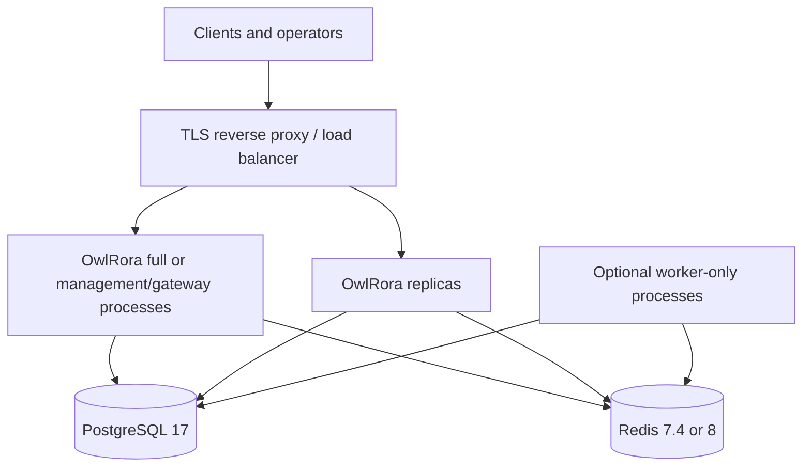

# Deployment

OwlRora is one stateless-at-the-edge Rust server with embedded Console assets. Durable state lives in PostgreSQL; Redis is a required coordination dependency for every non-`health-only` profile in the current implementation.

::: warning Released image boundary
Use only immutable version tags or digests. The latest published `server-v0.0.3` image predates the Phase 2 Gateway plane. Build the current source tree to evaluate Phase 2, or wait for a newer `server-v<semver>` release. OwlRora does not publish or promote a mutable `latest` image tag.
:::

## Tested deployment components

Repository CI and image smoke tests currently exercise:

- PostgreSQL 17;
- Redis 7.4 and Redis 8;
- the Debian-based `linux/amd64` server image built by GitHub-hosted runners.

This is evidence of tested combinations, not a declaration that every older PostgreSQL/Redis release or every container architecture is supported. The server release workflow currently publishes one image architecture per release run, not a multi-architecture manifest.

## Deployment profiles

| Profile          | HTTP surfaces                                                               | Workers                | Required external state |
| ---------------- | --------------------------------------------------------------------------- | ---------------------- | ----------------------- |
| `full` (default) | `/health`, public coarse `/ready`, Console, Management API, Gateway ingress | management and gateway | PostgreSQL, Redis       |
| `management`     | `/health`, public coarse `/ready`, Console, Management API                  | management             | PostgreSQL, Redis       |
| `gateway`        | `/health`, Gateway ingress; no `/ready`                                     | gateway                | PostgreSQL, Redis       |
| `worker`         | `/health` only                                                              | management and gateway | PostgreSQL, Redis       |
| `health-only`    | `/health` only                                                              | none                   | none                    |

The official binary uses bundled software custody, so every non-`health-only` profile also requires `OWLRORA_SECRET_ROOT`. `full` and `management` additionally require the public origin and seed administrator key.

Start with `full` unless you have a concrete isolation or scaling reason. Split profiles use the same database, Redis endpoint, installation identity, seed-key material where management is enabled, and secret root.

## Production topology



Identical HTTP-serving replicas do not require load-balancer session affinity or durable application identities. Runtime diagnostics describe the process that answered the request; fleet inventory and rollout state remain responsibilities of the deployment platform.

## 1. Choose an immutable image

For a published release:

```bash
IMAGE='ghcr.io/owlfoundry/owlrora:<released-semver>'
docker pull "$IMAGE"
docker inspect --format '{{index .RepoDigests 0}}' "$IMAGE"
```

Use the resulting `ghcr.io/owlfoundry/owlrora@sha256:...` digest in production.

To evaluate current source instead:

```bash
git clone https://github.com/owlfoundry/owlrora.git
cd owlrora
git checkout main

docker build --pull \
  --build-arg OWLRORA_VERSION=0.0.0-dev \
  --build-arg VCS_REF="$(git rev-parse HEAD)" \
  --tag owlrora:source .
```

## 2. Provision PostgreSQL and Redis

The server uses its runtime PostgreSQL connection for embedded migrations. The database role therefore needs the DDL privileges required to create and alter tables, indexes, functions, triggers, and constraints.

Redis is not an optional cache in the current source. Startup connects and sends `PING`; a failure prevents a non-health-only process from starting. The client accepts one `redis://` or `rediss://` endpoint. Redis Cluster client mode is not implemented or tested; place a managed HA service behind one stable endpoint only after validating its failover behavior.

Capacity planning starts with per-process pools:

```text
potential PostgreSQL connections = processes × OWLRORA_DATABASE_MAX_CONNECTIONS
potential Redis connections      = processes × OWLRORA_REDIS_POOL_SIZE
```

Leave additional capacity for migrations, backups, monitoring, and administrative access.

## 3. Generate deployment secrets

Create the software-custody root and built-in seed Management API key once:

```bash
umask 077
python3 > owlrora-secrets.env <<'PY'
import base64
import secrets


def b64url(value: bytes) -> str:
    return base64.urlsafe_b64encode(value).decode("ascii").rstrip("=")


print("OWLRORA_SECRET_ROOT=" + b64url(secrets.token_bytes(32)))
print(
    "OWLRORA_SEED_ADMIN_API_KEY="
    + "owlrora_mgmt_v1."
    + b64url(secrets.token_bytes(16))
    + "."
    + b64url(secrets.token_bytes(32))
)
PY
chmod 600 owlrora-secrets.env
```

Store both in a deployment secret manager. Never put production values in Git, image layers, Compose YAML, or PostgreSQL.

- Losing `OWLRORA_SECRET_ROOT` makes existing recoverable secret envelopes unreadable.
- Changing it is not an online rotation mechanism; the official binary has no root ring.
- Changing the seed key changes its deterministic version identity and invalidates key-derived seed sessions across the fleet.

## 4. Create the runtime environment

Append a single-process `full` configuration:

```bash
cat >> owlrora-secrets.env <<'EOF'
OWLRORA_PROFILE=full
OWLRORA_ADDR=0.0.0.0:8080
OWLRORA_PUBLIC_ORIGIN=https://owlrora.example.com
OWLRORA_DATABASE_URL=postgresql://owlrora:<password>@postgres.internal:5432/owlrora
OWLRORA_REDIS_URL=rediss://:<password>@redis.internal:6379/0
OWLRORA_OPERATOR_NETWORKS=127.0.0.0/8,::1/128
RUST_LOG=info
EOF
chmod 600 owlrora-secrets.env
```

Replace placeholders before starting. See [Configuration](/deployment/configuration) for every setting and range.

## 5. Start the non-root container

```bash
docker run --detach \
  --name owlrora \
  --restart unless-stopped \
  --env-file ./owlrora-secrets.env \
  --publish 127.0.0.1:8080:8080 \
  'ghcr.io/owlfoundry/owlrora@sha256:<pinned-digest>'
```

The image runs as UID/GID `10001`, uses `tini` as PID 1, and requires no persistent application volume. If you enforce a read-only root filesystem, validate it with every configured workload/default-chain credential provider because those external SDK chains may read provider-specific files or metadata.

## 6. Terminate TLS at a trusted proxy

The server currently serves plaintext HTTP and does not implement native listener TLS. Bind it to loopback or a private network and terminate TLS at a reverse proxy that supports SSE and WebSocket upgrades.

Use separate public and operator ingress. This Caddy example blocks protected operations paths on the public host and exposes them only on a private operator host:

```text
owlrora.example.com {
    @operator_operations path /api/v1/system/operations*
    respond @operator_operations 404

    reverse_proxy 127.0.0.1:8080 {
        flush_interval -1
    }
}

owlrora-ops.internal.example.com {
    bind 10.0.0.10
    reverse_proxy 127.0.0.1:8080
}
```

Restrict the operator hostname with private routing, firewall policy, and appropriate proxy authentication. With a same-host proxy, keep `OWLRORA_OPERATOR_NETWORKS=127.0.0.0/8,::1/128`; OwlRora evaluates the direct proxy peer and does not consume forwarded-client-IP headers. If the proxy connects over a container or private network, configure only that proxy CIDR instead. Set `OWLRORA_PUBLIC_ORIGIN` to exactly the browser-visible public HTTPS origin.

## 7. Check liveness and readiness

```bash
curl -fsS http://127.0.0.1:8080/health
```

`/health` returns `ok` when the HTTP process is alive. It does not prove PostgreSQL, Redis, runtime publication, routes, or workers are ready.

For `full` and `management`, `/ready` is a public coarse load-balancer signal that returns only `{"status":"ready"}` or `{"status":"not_ready"}`:

```bash
curl -fsS https://owlrora.example.com/ready
```

Retrieve detailed protected evidence separately:

```bash
owlrora \
  --server-url https://owlrora-ops.internal.example.com \
  --key-env OWLRORA_MANAGEMENT_API_KEY \
  --output json \
  system operations readiness
```

`gateway` and `worker` profiles do not expose `/ready` in the current implementation. Use `/health` only for process liveness. Protected operations called on a management process describe that process plus durable/shared evidence; they do not prove the local runtime or worker state of separate gateway/worker processes. Use deployment-platform rollout checks and external end-to-end probes for those profiles.

## Next steps

- [Configuration](/deployment/configuration)
- [Production operations](/deployment/operations)
- [Security model](/reference/security)
- [Implementation status](/reference/implementation-status)
