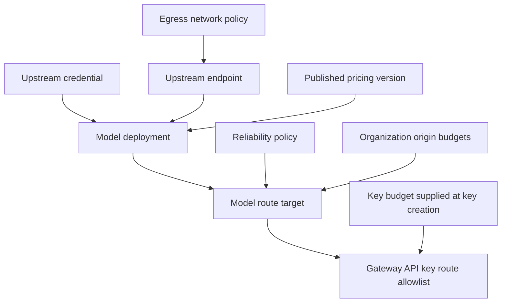

# Management plane

::: warning Release boundary
Confirm that the selected server and CLI releases expose the same management inventory before deployment. When evaluating unreleased source, build both components from the same revision.
:::

OwlRora exposes one versioned Management API under `/api/v1`, an embedded Console, a generated typed CLI, and a local stdio MCP adapter. All four surfaces converge on the same authorization, tenancy, `ETag`, audit, idempotency, and one-time-secret semantics.

## Principals and authority

Management requests may authenticate as:

- the built-in configuration-only `seed_admin` Management key;
- a deployment-owned or organization-owned Management API key;
- a short-lived key-derived browser session;
- an explicitly configured external JWT issuer;
- a bounded OIDC browser session mapped to a local user through an issuer profile.

A durable key is a deployment or organization resource principal. Its creator is audit attribution only and does not become runtime ownership.

Effective authority is always the intersection of credential scope, immutable resource scope, current policy, organization membership/role where applicable, and any required system-administrator grant. A coarse `management:access` claim never grants operation scopes or deployment-wide reach by itself.

## API shape

### Queries

Queries use `GET` and never mutate state.

### Commands

Commands use `POST`. Ordinary resource changes use coarse `.../actions/update` operations with tri-state input fields:

- absent: leave unchanged;
- value: replace;
- explicit null: clear when the field is nullable.

OwlRora does not expose application `PUT`, `PATCH`, or `DELETE` operations.

### Optimistic concurrency

Resource reads return an opaque HTTP `ETag`. Every coarse update requires that exact value in `If-Match`.

- Missing precondition: HTTP `428`.
- Stale precondition: HTTP `412`.
- A successful command may be committed before every process has applied the new runtime generation.

Successful commands return `x-owlrora-command-status: committed`. The response also reports the process that handled the command without assigning it an identity:

- `x-owlrora-process-publication: applied | pending`;
- `x-owlrora-applied-revision`: that process's applied revision;
- `x-owlrora-database-revision`: the durable revision observed after the command.

These headers and current-process operations evidence distinguish durable commit from local publication. They do not prove fleet-wide rollout. Do not parse an `ETag` or treat it as a database revision.

### Idempotency and one-time secrets

The operation descriptor marks commands that require an idempotency key. Secret-creating or rotating commands return plaintext only in the original successful response. Retrying with the same idempotency key may confirm the outcome but does not recreate a plaintext secret after it has been consumed.

Use `--output json` for secret-bearing CLI operations and redirect directly to a protected destination. Table rendering intentionally does not truncate secrets, so do not display them in an interactive terminal unless intended.

## Discover the live contract

The server publishes authenticated, generated contract resources:

- `GET /api/v1/operations` — the server's typed operation catalog;
- `GET /api/v1/openapi.json` — OpenAPI 3.1 description.

The repository generates static CLI and Console projections from the same descriptor and checks drift in CI. A released CLI does not negotiate or download a replacement command inventory at runtime; use a client built from a compatible server revision. Prefer the descriptor over manually inventing endpoint strings.

## Resource ownership

### Deployment-owned resources

System administrators manage:

- egress network policies;
- upstream endpoints;
- deployment upstream credentials;
- system model deployments and routes;
- system policy ceilings and grants;
- external issuers, custody evidence, and runtime operations.

### Organization-owned resources

Organization owners/admins, qualifying Management-key principals, and explicitly scoped system administrators may manage:

- organization BYOK credentials;
- same-organization deployments and routes;
- organization Gateway API keys;
- bounded budget/rate assignments and usage views;
- membership and organization policy within deployment ceilings.

BYOK does not grant endpoint editing, system egress policy ownership, or cross-organization secret reuse.

### Shared system catalog

An organization can consume a deployment-owned endpoint or model deployment only through an explicit grant. Requests and commands must carry unambiguous organization context; system authority does not silently invent tenant context.

## Recommended catalog workflow

Create separate resources even when one provider supplies all of them. This keeps endpoints reusable, credentials independently rotatable, deployments explicit, and client-facing model names stable.

## Audit and operational evidence

Accepted Management commands write durable audit evidence. Commands that affect runtime configuration additionally commit the domain change, audit record, configuration-journal revision, and outbox evidence atomically. Protected operation resources expose:

- durable database revision and current-process applied runtime revision;
- current-process runtime publication age and failures;
- durable policy activation and retirement state;
- live Redis coordination plus durable bounded-recovery evidence;
- current-process passive health and TTL-bounded Redis-shared active-probe summaries;
- current-process usage counters plus durable flush receipts and aggregate timestamps;
- custody provider status;
- telemetry configuration status.

Operator-only diagnostics require both system authority and a direct peer address inside `OWLRORA_OPERATOR_NETWORKS`. In split-profile deployments, Management operations cannot retrieve process-local state from gateway-only or worker-only replicas.
