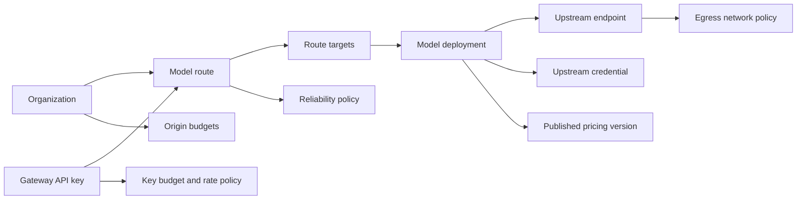

# Product overview

OwlRora stands for **Routing and Observability for Reliable AI**.

**Route Once. Reach All.**

OwlRora is a self-hosted, multi-tenant LLM gateway. A single Rust server owns the Management API, native-compatible Gateway ingress, background workers, and embedded React console. PostgreSQL stores durable configuration and compact evidence; Redis coordinates budgets, rates, concurrency, and short-lived distributed state.

::: warning Delivery boundary
The Phase 2 capabilities described as implemented below are present on repository `main` at and after commit `da26113`, but are newer than the latest published `server-v0.0.3` and `cli-v0.0.3` releases. The entire target specification is not yet complete. Consult [Implementation status](/reference/implementation-status) before treating a capability as released.
:::

## What is implemented on `main`

### Management and tenancy

- Deployment-wide administration and explicit organization workspaces.
- Local users, memberships, organization roles, system-administrator grants, external JWT issuers, bounded OIDC browser login, and issuer provisioning policy.
- Separate Management API keys and Gateway API keys with disjoint prefixes, verifier indexes, scopes, accepted surfaces, and audit attribution.
- Deployment-owned catalog resources, organization-owned BYOK credentials and deployments, and explicit grants for shared system catalog use.
- Query/command Management APIs with opaque `ETag` values, `If-Match` optimistic concurrency, idempotency, one-time secret return semantics, and generated OpenAPI/operation descriptors.

### Provider and route catalog

- Separate upstream endpoints, upstream credentials, model deployments, and first-class model routes.
- Directly versioned reliability resources, immutable published pricing versions, and generation-fenced budget/rate policy activation.
- Deployment and organization route ownership, stable route IDs, ordered target tiers, weighted selection, health state, circuit state, retry, failover, and stickiness.
- Organization origin accounting that distinguishes system-provided and organization-BYOK attempts.

### Protocol-native Gateway plane

- OpenAI Chat Completions over HTTP and SSE.
- OpenAI Responses over HTTP, SSE, and WebSocket.
- Anthropic Messages over HTTP and SSE.
- Google Gemini `generateContent` and `streamGenerateContent`.
- Matching upstream transports, including OpenAI-compatible endpoints, Anthropic, Gemini/Vertex, Azure-hosted OpenAI semantics, AWS Bedrock SigV4, and the explicitly modeled community-maintained OpenAI Codex subscription adapter.
- Request-scoped network, body, stream, timeout, and in-flight bounds without converting every protocol through a lossy universal payload.

### Admission, accounting, and evidence

- Gateway-key route allowlists and finite overall budgets.
- Paired key and organization-origin budget settlement for every physical attempt.
- Enforced or record-only budget and rate policies, strict or approximate concurrency, and bounded Redis recovery.
- Logical-request and physical-attempt usage aggregation with explicit terminal classifications.
- Protected management evidence for current-process runtime publication, Redis coordination, usage aggregation, policy activation, and active health probes, with explicit local/shared/durable scopes.

### Operator surfaces

- Embedded GitLab-like Console under `/admin`, `/organizations/{organization_id}`, and a small personal area.
- Generated typed `owlrora` CLI commands over public Management APIs only.
- Local stdio MCP mode exposing the same typed operation catalog without a generic raw HTTP tool.
- Deployment profiles for full, management, gateway, worker, and health-only processes; replicas are stateless and need no durable application identity.

## Core resource model

A client-facing model name is a route. There is no separate model-alias abstraction. Endpoints, credentials, and deployments remain reusable resources rather than one provider-connection aggregate.

## Request lifecycle

1. Capture one immutable runtime generation.
2. Parse the protocol-native request and authenticate either a Gateway API key or a qualified direct JWT principal.
3. Enforce the stable route allowlist, policy ceilings, request/body bounds, and distributed admission.
4. Select a compatible, operational target using tier, weight, health, circuit, retry, and stickiness policy.
5. Reserve the actual key and origin allowances for that physical attempt.
6. Dispatch with the target's protocol-matching transport and credential injection.
7. Classify the attempt, settle usage against the actual origin, update passive health, and enqueue compact evidence asynchronously.

PostgreSQL is not consulted on the normal request path after generation capture, and raw request bodies are not synchronously logged.

## Deliberate product boundaries

OwlRora is not an identity provider, billing ledger, prompt manager, agent framework, semantic cache, vector database, model-training platform, or arbitrary reverse-proxy plugin host. OwlAuth may be integrated as an optional adapter, but OwlRora does not require it.

See [Implementation status](/reference/implementation-status) for target work that remains, including standard OpenTelemetry export and several production-lifecycle closure items.
