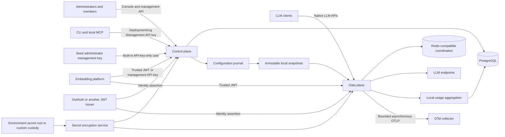

# Product scope and system context

## 1. Product definition

OwlRora is a self-hosted, multi-tenant LLM gateway.

- **Routing** selects a compatible upstream model deployment without coupling applications to provider accounts.
- **Observability** exposes request, attempt, token, cost, latency, health, and routing evidence.
- **Reliable** applies bounded retry, failover, affinity, circuit breaking, rate limits, and overload protection.
- **AI** limits the product to LLM traffic rather than general reverse proxying.

OwlRora provides a complete control plane and data plane in one deployable system. The control plane includes system administration, tenant administration, policy, catalog management, operational views, and the embedded web console. The data plane serves synchronous and streaming LLM requests.

## 2. Product capabilities

The architecture covers:

1. a built-in API-key-only `seed_admin` user plus local/synthetic users, organizations, memberships, and system administrators;
2. deployment-owned and organization-owned scoped Management API keys for direct API, CLI, MCP, and optional browser-session exchange;
3. a deployment-supplied full-scope management API key for `seed_admin`;
4. pluggable external JWT identity, including optional OwlAuth integration;
5. organization-owned OwlRora Gateway API keys and direct trusted-JWT LLM access;
6. independent upstream credentials, endpoints, model deployments, and model routes, including organization-only BYOK credentials/deployments;
7. Anthropic Messages, OpenAI Chat Completions, OpenAI Responses, and Google Gemini ingress;
8. OpenAI Codex subscription credentials for the Responses semantic family;
9. protocol-native streaming, error, usage, and provider adaptation;
10. deterministic weighted routing, preferred affinity, state-origin affinity, health probing, retry, failover, and circuits;
11. required Gateway-key route allowlists and overall budgets, plus separate organization system-provider/BYOK origin budgets and key-only rate/concurrency policy;
12. organization/user/gateway-key usage attribution and standard OpenTelemetry export;
13. encrypted recoverable provider secrets using a bundled environment-root implementation or a statically composed user-provided custody SPI;
14. immutable local runtime snapshots and horizontally replicated data-plane nodes;
15. an official CLI and local stdio MCP server covering the typed management surface through public HTTP APIs.

The data and cache design is shaped for at least 10 million logical requests per day without a PostgreSQL operation or durable raw request record per request. The objective governs data growth, synchronization, and horizontal scaling; it does not assert that one node sustains the entire workload.

## 3. Product boundary

OwlRora is not:

- an identity provider;
- a billing, payment, credit, invoice, entitlement, or commercial subscription system;
- a universal lossless translator between LLM protocols;
- an agent runtime, workflow engine, prompt-management system, vector database, or evaluation platform;
- a durable prompt/response archive;
- a general-purpose layer 7 proxy;
- a complete metrics, logs, or traces backend;
- a provider credential marketplace.

A platform may change a budget limit or begin a new accounting epoch through OwlRora. The commercial reason and customer balance semantics remain outside OwlRora.

## 4. Actors

| Actor | Purpose | Authority boundary |
| --- | --- | --- |
| **System administrator** | the built-in `seed_admin` user, a granted local user, or a granted deployment Management-key principal manages deployment-wide identity, tenants, upstream resources, shared routes, security, and operations | whole OwlRora deployment |
| **Organization owner** | controls organization membership and policy within system ceilings | one organization |
| **Organization administrator** | performs delegated tenant administration | granted organization actions |
| **Organization member** | invokes permitted routes and performs explicitly policy-enabled organization self-service | one organization within member and key-issuance policy |
| **LLM client** | sends protocol-compatible requests | untrusted input |
| **External identity issuer** | signs JWTs for human or platform subjects | configured authentication claims only |
| **Embedding platform** | provisions OwlRora state and embeds it into another product | explicit system or delegated APIs |
| **Upstream provider** | executes one model attempt and reports usage | external, fallible dependency |
| **Telemetry collector** | receives asynchronous OTLP signals | operational dependency, never admission authority |

Synthetic users and organizations are ordinary local entities whose external real-world identity is absent or managed elsewhere. They receive no implicit privilege.

## 5. Protocol scope

OwlRora exposes four native ingress families:

| Family | Core request form |
| --- | --- |
| Anthropic Messages | `POST /v1/messages` |
| OpenAI Chat Completions | `POST /v1/chat/completions` |
| OpenAI Responses | `POST /v1/responses` |
| Google Gemini | `generateContent` and `streamGenerateContent` model actions |

Each family retains its native request, response, streaming, error, tool, reasoning, and usage semantics. Provider-hosted variants such as Bedrock, Vertex, and Azure use explicit adapters within a compatible semantic family.

Codex subscription is an upstream authentication/transport option for OpenAI Responses. It is not a general provider-subscription framework and does not imply Chat Completions subscription support.

## 6. System context

Control plane, data plane, workers, and console ship in one Rust server. Their latency, authority, and failure boundaries remain explicit even when they share a process.

## 7. Authority boundaries

### 7.1 OwlRora authority

OwlRora is authoritative for:

- the built-in `seed_admin` user, its fixed management-only authority, and deployment key configuration;
- local users, resource-owned durable scoped Management API keys, and system-administrator grants;
- organizations, memberships, roles, organization API-key policy, and resource ownership;
- external identity bindings and trusted-issuer policy;
- the strict separation of management API keys from gateway API keys and each class's effective scopes;
- upstream credentials, endpoints, deployments, routes, targets, pricing, and grants;
- Gateway-key route/budget/rate/concurrency configuration and organization-qualified system-provider/BYOK origin budgets;
- route selection and request admission;
- local audit and compact usage aggregates.

### 7.2 External identity authority

An external issuer proves the configured `(issuer, subject, audience)` assertion. OwlRora maps that assertion to a local user and evaluates all current local authority itself.

Email, username, group, organization, or role claims do not directly grant membership or administration. An explicit provisioning policy may translate selected claims into ordinary audited domain commands.

### 7.3 Upstream authority

An upstream endpoint is authoritative for the payload and reported usage of one attempt. OwlRora validates and classifies the result, but provider-reported names, headers, or permissions never alter local routing or authorization policy.

### 7.4 Embedding-platform authority

An embedding platform decides commercial lifecycle and may provision OwlRora through authorized APIs. OwlRora validates the caller, applies local invariants, publishes runtime state, and records the action. It does not infer billing meaning.

## 8. Resource ownership

Every tenant resource contains:

- an opaque stable identifier;
- a non-null `organization_id`;
- lifecycle status where use can be enabled or disabled;
- creation and update timestamps.

Organization Management/Gateway API keys and organization BYOK credentials/deployments are owned by the organization, never by the user or automation principal that created them. They contain immutable `created_by_principal` audit attribution, but creator lifecycle and authority do not control later admission. Organization owners/admins manage them; exact-capability same-organization Management-key principals and qualifying system administrators may act through explicit organization context, and organization policy may allow bounded member creation. Organization-owned routes retain their separately specified route-owner invariant until that model is explicitly changed.

Deployment Management API keys and system catalog resources use deployment scope rather than a fake system organization. Relationship, aggregate, policy, and audit rows use actor/subject attribution appropriate to their meaning and do not invent a misleading owner.

## 9. Unified request lifecycle

A logical LLM request follows one orchestrated path:

1. parse bounded transport metadata, assign a request ID, and capture one immutable `RuntimeGeneration`;
2. authenticate an organization Gateway API key into its key principal or a trusted JWT into a local-user principal from that generation;
3. resolve explicit organization context; require active membership for the JWT user, while a Gateway key must match its active organization resource and current key policy without fabricating membership;
4. derive effective permissions, route access, and request capabilities from the principal, credential, and tenant policy in that generation;
5. apply cheap overload checks and, only for a Gateway key, key-scoped logical-request rate/concurrency admission;
6. resolve any strict provider-state origin from that route and principal context;
7. construct a deterministic ordered set of compatible targets from the same generation;
8. for a Gateway key, apply target capacity plus candidate-specific pricing and atomically reserve the key's overall budget with the selected deployment's derived system-provider/BYOK origin budget; for JWT traffic, apply target capacity without fabricating quota;
9. dispatch through the matching credential client in that generation under bounded retry/failover policy;
10. commit exactly one downstream response or stream;
11. extract per-attempt usage and reconcile approximate enforcement state;
12. update local aggregates and emit bounded telemetry;
13. release request-scoped resources.

The captured generation is the sole source for authentication, tenant qualification, authorization, route and target eligibility, credential-client lookup, and dispatch; a request never combines those decisions across generations. No upstream request begins before authorization, route compatibility, strict-origin resolution where applicable, and target-specific admission complete. Once response bytes are committed, no later target can contribute bytes to that response.

## 10. Deployment and scaling principles

1. OwlRora operates without OwlAuth and without any particular identity provider.
2. PostgreSQL owns durable control-plane state, encrypted secret records, audit, and compact aggregates.
3. Data-plane nodes use immutable local snapshots and do not query PostgreSQL per request.
4. A durable change journal plus wake-up notifications keeps local caches synchronized. Notifications improve latency; ordered replay provides convergence.
5. Optional Redis-compatible coordination holds bounded ephemeral allowance, rate, health, state-origin, and lease data. Standalone Redis is supported; Redis Cluster or managed high availability is recommended for production but not required.
6. Budget and quota enforcement deliberately permit documented bounded drift rather than turning Redis into a financial ledger.
7. Ordinary preferred affinity is deterministic and does not require a per-request session write.
8. Data-plane replicas are horizontally scalable and require no load-balancer stickiness.
9. Request and attempt analytics are aggregated locally and flushed in idempotent batches.
10. Provider clients, decrypted credentials, circuits, and snapshots are versioned runtime objects rebuilt outside the request path.

## 11. Failure posture

| Condition | System behavior |
| --- | --- |
| PostgreSQL unavailable after a valid snapshot | data plane continues within the configured snapshot-staleness bound; management and aggregate flush degrade |
| no valid snapshot at startup | data plane remains unready |
| Redis unavailable or failed over | behavior follows each policy’s explicit availability mode; approximate counters may lose bounded recent state |
| telemetry collector unavailable | requests continue; bounded telemetry queues drop with self-observability |
| aggregate persistence unavailable | requests continue; bounded local deltas may be dropped visibly |
| one upstream target unhealthy | deterministic next target, retry/failover policy, or route-scoped unavailable response |
| a credential, membership, grant, route, endpoint, or deployment is disabled | security journal publishes a fail-closed snapshot within the revocation objective |
| stream fails after commitment | terminate the stream; never splice another attempt |
| environment root missing/wrong or custom custody unavailable | existing loaded clients may continue within secret-cache policy; affected secret creation, rotation, or rebuild fails safely |

Failure modes are isolated by affected capability. An optional dependency does not make the whole node globally unavailable unless no valid runtime state can be served.
