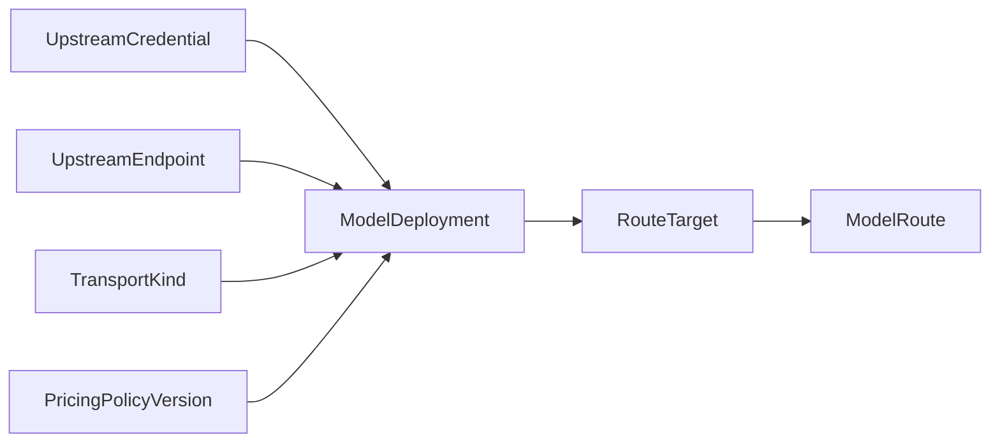

# Upstream credential, endpoint, model, and route catalog

## 1. Catalog structure

OwlRora does not model a provider as one object containing vendor kind, endpoint, account, credential, transport, and model. Those concerns have different reuse and lifecycle boundaries.



The core resources are:

- `UpstreamCredential` — reusable authentication material and typed injection behavior;
- `UpstreamEndpoint` — validated network origin and adapter profile;
- `ModelDeployment` — callable binding of credential, endpoint, transport, and upstream model;
- `ModelRoute` — client-facing routing and policy boundary;
- `RouteTarget` — deployment membership within a route.

Vendor names remain useful metadata and adapter labels, but there is no broad `ProviderKind` aggregate that determines all behavior.

## 2. Upstream credentials

An `UpstreamCredential` is an independently managed secret or workload-identity configuration.

| Field | Meaning |
| --- | --- |
| `id`, `name` | stable identity and unique label within resource scope |
| `scope` | immutable `system` or exactly one `organization_id` |
| `created_by_principal` | immutable audit attribution; never owner or ongoing authority |
| `credential_kind` | exact typed authentication contract |
| `secret_source` | encrypted PostgreSQL value, environment reference, mounted-file reference, or workload-identity configuration |
| `injection_policy` | typed adapter-owned header/query/signing/token-refresh behavior |
| `tenant_sharing_policy` | system credential sharing policy, or fixed same-organization-only for organization BYOK |
| `administrative_status` | `active` or `disabled`, controlled by an administrator |
| `auth_lifecycle_state` | credential-kind state such as ready, refreshing, error, expired, or revoked |
| `secret_version` | monotonic secret/client-build version |
| `state_identity_version` | monotonic upstream account/project security-domain identity version |
| `metadata` | safe account/project/subscription labels |
| timestamps | creation, rotation, validation, refresh, update |

Credential kinds include:

- `static_api_key` with a typed header or query placement owned by the registered adapter;
- `oauth_openai_codex` with encrypted refresh state and Codex account metadata;
- `aws_default_chain` and `aws_assume_role`;
- `google_application_default` and `google_service_account`;
- typed Azure API-key or workload-identity credentials.

There is no generic arbitrary-header template accepting unreviewed secret injection. A credential kind defines exactly which adapter families may use it and how upstream authentication is rebuilt.

A system credential may be referenced by multiple deployments and endpoints when adapter compatibility and tenant-sharing rules permit it. An organization BYOK credential is owned by exactly one organization, is never system-shared or granted to another organization, and may be referenced only by same-organization deployments. Because a credential normally represents the upstream account/project/quota identity, its scope/sharing policy—not the network URL or creator—controls where it may serve. Secret rotation increments `secret_version` and rebuilds every dependent client without changing deployment or route identity. A confirmed account/project/security-domain change increments `state_identity_version`; routine access-token refresh that preserves the same confirmed account does not. Secret replacement preserves the state identity only when the typed adapter can prove the immutable upstream account/project identity is unchanged; otherwise it increments conservatively.

### 2.1 Secret sources

- Encrypted database secrets use the envelope-encryption service described in spec 11.
- Organization BYOK accepts only write-only encrypted-database material for adapter kinds explicitly marked organization-self-service-safe. Host environment/file references, workload identity, arbitrary headers, and `oauth_openai_codex` are system-only because their lifecycle or host authority is not an organization resource.
- Environment and file sources for system credentials persist only a reference and are read while building or rebuilding the credential runtime object.
- System workload identity persists configuration but no static bearer secret.
- Raw values are accepted only by write-only create/replace flows and never returned by list/detail/export APIs.
- Runtime snapshots contain credential identity/version references, not serializable plaintext.
- Decrypted values live only in redacted credential/client objects and are never read from PostgreSQL or files per request.

OwlRora gateway API keys are not `UpstreamCredential` records. They remain non-recoverable SHA-256 digests.

### 2.2 Codex subscription credential

`oauth_openai_codex` is the only subscription credential type.

It stores, under authenticated encryption:

- OAuth refresh state required to obtain access tokens;
- current access token only when the flow requires caching it;
- token expiry and refresh metadata;
- the selected Codex account identifier when required by upstream headers;
- safe subscription/account display metadata separately from secret material.

Its injection policy is valid only for the built-in best-effort Codex Responses adapter. It cannot authenticate Chat Completions, arbitrary OpenAI API endpoints, or another provider’s subscription service. Other subscription credential kinds are intentionally absent from the catalog. Its administrative status and Codex auth lifecycle are separate; the credential is eligible only when both are active.

## 3. Upstream endpoints

An `UpstreamEndpoint` is a deployment-owned network and protocol-host profile without authentication material. Organization users cannot create or edit endpoints; BYOK deliberately does not grant arbitrary egress configuration.

| Field | Meaning |
| --- | --- |
| `id`, `name` | stable identity and operator label |
| `adapter_kind` | exact endpoint/path/error/auth integration behavior |
| `base_url` | provider default or explicit normalized HTTPS origin/path prefix |
| `region`, `api_version` | typed optional endpoint parameters |
| `network_policy_ref` | egress, proxy, DNS, TLS, and custom-CA policy |
| `default_headers` | tightly allowlisted non-secret headers |
| `status` | `active`, `disabled`, or `degraded_by_operator` |
| `config_version` | monotonic runtime version |
| timestamps | creation, validation, update |

Examples of `adapter_kind` are `anthropic_api`, `aws_bedrock_runtime`, `google_vertex`, `google_gemini_api`, `openai_api`, `openai_codex`, and `azure_openai`. The label selects reviewed endpoint behavior; it does not bundle credential state or model capabilities.

An endpoint can be shared by many credentials and deployments. A credential can be used against many compatible endpoints. The `ModelDeployment` is where a specific combination becomes callable. An organization may use an endpoint in a BYOK deployment only through an explicit `OrganizationEndpointGrant`; revoking the grant makes dependent organization deployments ineligible without exposing other endpoint or credential details.

### 3.1 Endpoint safety

Explicit endpoints are system-administrator resources and must:

- use HTTPS except an explicit development-only loopback profile;
- reject userinfo, URL ambiguity, and uncontrolled redirects;
- enforce DNS/IP checks against private, loopback, link-local, metadata, and organization-internal ranges unless system policy permits them;
- revalidate resolved addresses at connection time;
- apply bounded TLS, proxy, connection, body, and redirect policy;
- prevent caller input from selecting host, scheme, project, region, or credentials.

Endpoint configuration cannot turn the data plane into an SSRF proxy.

## 4. Transport kinds

A `TransportKind` identifies the exact upstream wire contract. Representative kinds are:

- `anthropic_messages_native`;
- `anthropic_messages_bedrock`;
- `anthropic_messages_vertex`;
- `openai_chat_completions`;
- `openai_responses_http`;
- `openai_responses_websocket`;
- `openai_codex_responses`;
- `azure_openai_chat_completions`;
- `azure_openai_responses`;
- `google_gemini_generate_content`;
- `google_vertex_generate_content`.

The adapter registry validates `(endpoint.adapter_kind, credential.credential_kind, transport_kind)`. A combination exists only when protocol fixtures cover endpoint construction, authentication, request/stream behavior, errors, usage, and cancellation. Adapter behavior ships with the running OwlRora build rather than creating a separately managed compatibility-profile catalog.

“OpenAI compatible” is not a transport contract by itself.

## 5. Model deployments

A `ModelDeployment` is one callable upstream model binding. Its immutable resource scope also derives its accounting origin: `system` becomes `system_provided`, while one exact organization becomes `organization_byok`. No route, caller, or key can override that origin.

| Field | Meaning |
| --- | --- |
| `id`, `name` | stable identity and label within resource scope |
| `scope` | immutable `system` or exactly one `organization_id` |
| `created_by_principal` | immutable audit attribution for organization deployments |
| `endpoint_id` | one system-owned upstream network profile |
| `credential_id` | one compatible authentication identity |
| `transport_kind` | exact wire adapter implemented by the running OwlRora build |
| `upstream_model_id` | provider-native model/deployment identifier |
| `model_family` | optional display metadata, never authorization |
| `capability_set` | tested feature declarations |
| `context_limits` | known input/output/context bounds |
| `state_isolation_profile` | typed cache/continuation isolation guarantees of this credential/endpoint/transport binding |
| `pricing_policy_version_id` | immutable pricing reference or explicit unpriced state |
| `status` | `active`, `disabled`, or `validation_failed` |
| `config_version` | monotonic version of origin-defining deployment behavior |
| timestamps | creation, validation, update |

The same conceptual model exposed through Anthropic, Bedrock, Vertex, or several regional endpoints is represented by distinct deployments. This preserves endpoint, credential/account, quota, price, state-isolation, and health differences for routing. A system deployment uses system catalog resources. An organization deployment must use a same-organization BYOK credential, a system endpoint granted to that organization, an adapter-approved transport, and either a compatible published pricing version made organization-usable by system policy or explicit unpriced state under the existing budget rules. It cannot reference a system credential or another organization's resource. Deployment activation rejects a tenant-sharing profile wider than credential scope or adapter cache/state isolation guarantees.

### 5.1 Capabilities

Capabilities are typed and may include:

- protocol family and streaming mode;
- tools and parallel tool calls;
- image, audio, document, or other LLM multimodal input;
- structured output and JSON-schema constraints;
- prompt caching and reported cache usage;
- system/developer instruction behavior;
- reasoning controls and opaque reasoning state;
- provider-side continuation;
- usage availability;
- idempotency support;
- context and output limits.

Each capability is `supported`, `unsupported`, or `conditional` under typed constraints. Unknown means unsupported. Marketing model names never establish capability.

### 5.2 Validation

Validation checks endpoint connectivity, credential compatibility, model availability, and minimal protocol conformance with the least practical billable work. Results are timestamped evidence rather than permanent health truth. Validation errors are sanitized and do not silently disable an active deployment unless the administrator requested that transition.

## 6. Pricing

A versioned pricing policy maps typed usage dimensions to integer cost. Pricing attaches to a deployment because endpoint, region, account type, and transport may alter price for the same model.

An unpriced deployment can serve only when no applicable monetary budget requires known cost and route policy explicitly permits unknown cost. Unknown is never treated as zero.

Every attempt captures its immutable pricing version before dispatch; later updates do not rewrite history.

## 7. Model routes

A `ModelRoute` is the client-addressable model and routing policy.

| Field | Meaning |
| --- | --- |
| `id` | immutable opaque identity |
| `scope` | system or one organization |
| `owner_user_id` | required for organization-owned routes |
| `model_key` | exact client-facing key unique in scope and protocol family |
| `ingress_protocol_family` | one native request contract |
| `required_base_capabilities` | contract every target must satisfy |
| `selection_policy` | priority, integer weights, affinity, algorithm version |
| `reliability_policy_id` | retry, failover, health, circuit, timeout policy |
| `request_policy` | request/output/stream ceilings |
| `status` | `draft`, `active`, or `disabled` |
| `config_version` | active publication version |

A route with one target remains a route. There is no model-alias entity, prefix fallback, implicit `provider/model` syntax, or arbitrary caller model pass-through.

### 7.1 Namespace resolution

For one organization and protocol family:

1. resolve an exact active organization route by `model_key`;
2. otherwise resolve an exact active system route with an organization grant;
3. otherwise return a non-enumerating model-access error.

### 7.2 System grants and organization routes

A system route is visible to an organization only through an `OrganizationRouteGrant`. The grant may narrow capabilities, output/context ceilings, availability, and policy ceilings but cannot add targets or reveal upstream credentials.

Advanced tenants may create organization routes from explicitly granted system deployments, same-organization BYOK deployments, and granted reliability policies. They may mix both deployment origins in one route and choose route-local targets, priorities, and weights. System and BYOK targets participate in the same capability filtering, health, weighting, affinity, retry, failover, streaming, continuation, and observability behavior; OwlRora does not reduce BYOK to a separate direct-provider shortcut. Only attempt accounting differs: a Gateway-key attempt always consumes the key's overall budget and then the organization origin pool derived from the selected deployment. Organization owners/admins—and members only when explicit self-service policy allows—may create/replace organization BYOK credentials and create organization deployments, but they cannot change system endpoints, transports, egress policy, system health ceilings, or another scope's secret material. BYOK resources remain organization-owned when their creator leaves.

Organization-route create always names one eligible active-member `owner_user_id`; an acting Management-key/system-administrator principal cannot be substituted or fabricated as that owner. Ownership can be transferred only to another eligible active member through an explicit audited command that requires the current route ETag. Removal of the current owner's membership disables new route admission until ownership is resolved.

## 8. Route targets

A `RouteTarget` gives one deployment a role in one route.

| Field | Meaning |
| --- | --- |
| `id` | immutable, globally unique, never-reused target identity |
| `route_id`, `deployment_id` | immutable binding and unique route/deployment pair; changing deployment creates a new target |
| `priority` | non-negative tier, lower first |
| `weight_units` | integer `1..=256`, tier sum at most 256 |
| `enabled` | route-local eligibility switch |
| `capability_constraints` | optional narrowing |
| `affinity_identity` | immutable unique 16-byte route-local identity |
| `timeout_overrides` | narrowing of deployment/system ceilings |

Targets in one route must be semantically interchangeable for the route’s base contract. Request-specific optional capabilities filter targets before admission. A target gets its upstream model, endpoint, credential, transport, pricing, and derived `system_provided | organization_byok` budget origin from its deployment. Updating a target preserves its `id` and `affinity_identity`; deleting a target retires both permanently, so a later target cannot inherit strict-origin or affinity identity. Route edits cannot relabel a target's accounting origin.

## 9. Configuration publication

Catalog records compile into one immutable `GatewayConfigSnapshot`. Compilation rejects:

- dangling or disabled structural references during route activation;
- duplicate route keys in one organization/protocol namespace;
- incompatible endpoint/credential/transport combinations or tenant-sharing/state-isolation profiles;
- impossible capability intersections;
- duplicate affinity identities, unsupported routing algorithm versions, or invalid weight bounds;
- any target reachable by a Gateway key under an enforcing key/origin budget when that target cannot produce the policy's required finite estimate; record-only policies may retain explicitly visible unknown-cost targets;
- an active organization route without at least one structural target;
- any organization route target that is neither a same-organization deployment nor an explicitly granted system deployment;
- any organization route referencing a system reliability policy not explicitly granted to that organization;
- organization deployments using a foreign/system credential, ungranted endpoint, unsafe self-service credential kind/source, or incompatible pricing/transport;
- continuation support without durable organization/route/protocol and authenticated-principal-kind/`principal_affinity_id`-qualified origin handling;
- any serializable secret value in the snapshot or diagnostics model.

Drafts may be incomplete and never enter runtime state. Updating an active graph stages a complete candidate, validates it, and atomically publishes a new revision.

Structural validity and operational eligibility are distinct. Disabling a credential, endpoint, deployment, target, or grant always publishes fail closed even when dependent routes have zero usable targets. Corrupt structurally invalid state never replaces the last valid snapshot.

## 10. Change behavior

- Credential rotation preserves credential identity, increments secret version, and rebuilds dependent clients.
- Endpoint changes rebuild dependent clients after validation without changing credential identity.
- Disabling a credential or endpoint makes all dependent deployments ineligible.
- Disabling a deployment or target may leave a route operationally unavailable and still publishes immediately.
- Removing the final structural target requires disabling the route in the same candidate.
- Origin-defining deployment, endpoint, transport, upstream-model, or credential account-identity changes increment their relevant configuration/identity versions; existing strict-state bindings then fail closed rather than following the changed binding.
- Removing a target used by strict provider state retires its ID permanently and requires policy validation or an explicit force command with audit warning.
- Endpoint/deployment/reliability grant revocation invalidates dependent organization deployments/routes without retaining an older permissive snapshot.
- Creator disablement or membership removal does not disable organization BYOK credentials/deployments; organization suspension, resource disablement, policy tightening, or grant revocation does.
- Historical usage retains immutable deployment, derived accounting origin, endpoint, credential-safe identity, and pricing-version attribution across later renames.
- Retry/failover settlement uses the origin of each actual target attempt; a mixed route never charges all attempts to the route's first or preferred origin.

## 11. Example

```yaml
credentials:
  - name: shared-anthropic-key
    kind: static_api_key
    source: encrypted_database

endpoints:
  - name: anthropic-us
    adapter_kind: anthropic_api
    base_url: https://api.anthropic.com

model_deployments:
  - name: anthropic-us-sonnet
    endpoint: anthropic-us
    credential: shared-anthropic-key
    transport: anthropic_messages_native
    upstream_model_id: claude-sonnet-4

route:
  model_key: claude-sonnet
  ingress_protocol_family: anthropic_messages
  targets:
    - deployment: anthropic-us-sonnet
      priority: 0
      weight_units: 80
    - deployment: bedrock-us-sonnet
      priority: 0
      weight_units: 20
    - deployment: vertex-eu-sonnet
      priority: 1
      weight_units: 100
```

The credential can authenticate multiple compatible deployments. The endpoint can host multiple deployments or credentials. The route explicitly groups callable deployments and never hides them behind an alias.
