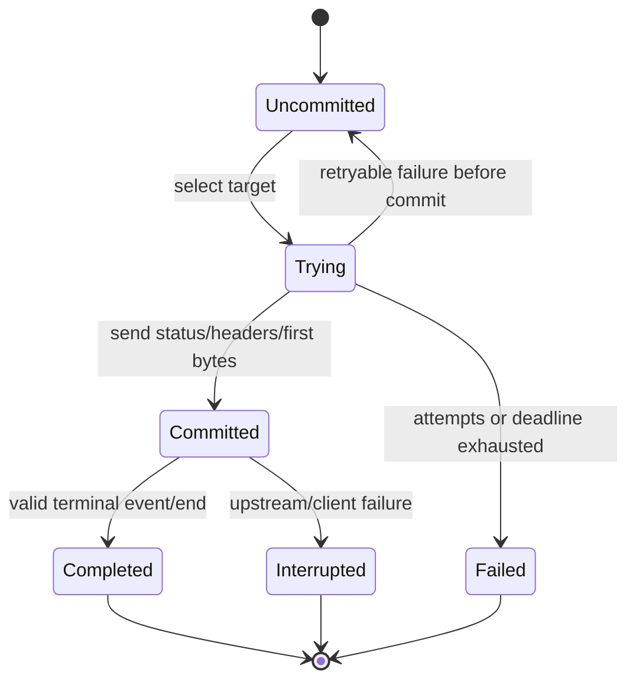

# Routing, reliability, and stickiness

## 1. Design principles

1. Routing operates on explicit route targets, never model aliases or arbitrary provider prefixes.
2. Static configuration and request capabilities determine eligibility before dynamic health.
3. Selection is deterministic for a request/affinity key and does not require centralized per-request metric reads.
4. Reliability is bounded by a total attempt/deadline budget.
5. Failover never changes the client-visible semantic contract.
6. A target can consume tokens or cost even when its attempt does not produce the final response.
7. Streaming failover is possible only before downstream commitment.
8. Provider-side state uses strict affinity and fails safely when its origin cannot be resolved.

## 2. Inputs

The router receives only immutable request and snapshot state plus local/coordinated runtime health:

```text
RoutingInput {
    request_id,
    admission_context,
    protocol_family,
    required_capabilities,
    route,
    eligible_targets,
    affinity_key?,
    strict_origin_identity?,
    request_deadline,
}
```

The router does not read prompts, PostgreSQL, usage aggregate tables, or whole-fleet telemetry to choose a target.

## 3. Eligibility pipeline

After route namespace resolution, request-level overload/rate/concurrency admission, and any required continuation-origin lookup, targets are filtered in this order:

1. credential, endpoint, deployment, route, and target are active in the captured runtime generation;
2. tenant grant permits the route/deployment;
3. transport is compatible with ingress protocol;
4. required request capabilities and limits are satisfied;
5. for a Gateway-key request, pricing/estimation metadata can satisfy every enforcing key and target-derived origin-budget requirement;
6. when strict origin exists, target ID and every origin-defining identity/version match exactly;
7. operator state has not forced the target unavailable;
8. local circuit and target-capacity state permit a probe/request;
9. the attempt has not already exhausted its per-target retry allowance.

A strict-origin request has at most one target. Only after that target is resolved does OwlRora calculate its exact request estimate, reserve the Gateway key's overall allowance plus that deployment origin's system/BYOK allowance when applicable, and acquire target capacity. Ordinary weighted ordering is never used to price or admit a continuation against a different candidate.

For an ordinary stateless Gateway-key request, OwlRora walks the bounded deterministic candidate order before dispatch. If a candidate cannot produce the finite estimate required by either enforcing policy, or cannot atomically obtain the key allowance plus its derived `system_provided | organization_byok` origin allowance, that candidate is rejected without dispatch or consumption and the next candidate may be considered. A reservation that succeeds is tied to that candidate/attempt and retains both policy identities. The request returns budget/estimate denial only after no candidate can be admitted; an exhausted system target may fall back to BYOK, or vice versa, only through the route's ordinary bounded candidate order. Direct-JWT requests perform the same target selection without fabricated quota checks.

A request with no statically compatible target fails as `unsupported_capability` or `no_eligible_target` before budget reservation. A request whose compatible targets are only dynamically unavailable fails as `route_unavailable` after reliability policy is applied.

## 4. Priority and weighted selection

### 4.1 Priority tiers

Lower numeric `priority` is preferred. The router uses the lowest tier containing at least one currently eligible target. It advances to the next tier only when:

- all targets in the current tier are unavailable/exhausted; or
- route policy explicitly permits early tier fallback for a classified condition.

Priority expresses operator intent, not measured latency.

### 4.2 Weighted rendezvous ordering

Within a tier, targets are ordered by the integer-only `replicated-wrh-v1` algorithm.

Organization, authenticated-principal affinity, and route IDs have canonical 16-byte internal values. `principal_affinity_id` is the globally unique immutable 16-byte local-user ID for JWT principals or Gateway API key ID for key principals; creator identity is never substituted. The affinity source tag is `0x00` for `x-owlrora-session-id`, `0x01` for a protocol-native affinity value, and `0x02` for request ID. Affinity/request values use their validated exact bytes without Unicode normalization.

```text
base = SHA-256(
  ASCII("owlrora/replicated-wrh-v1/base") || 0x00 ||
  organization_id[16] || principal_affinity_id[16] || route_id[16] ||
  source_tag[1] || value_length_u32_be || value_bytes
)
```

Each target has immutable `affinity_identity[16]` and integer `weight_units` in `1..=256`. The sum of configured target weight units in one priority tier MUST NOT exceed 256. For each eligible target and replica index `j` in `0..weight_units-1`:

```text
replica_digest[j] = SHA-256(
  ASCII("owlrora/replicated-wrh-v1/replica") || 0x00 ||
  base[32] || affinity_identity[16] || j_u16_be
)
target_score = lexicographic_max(replica_digest[*])
```

Digest bytes compare as unsigned bytes from index 0. Targets rank by `target_score` descending; an exact score tie ranks by `affinity_identity` ascending. Adding, removing, disabling, or filtering one target never changes another target’s score. Under an ideal hash, first-choice probability is proportional to `weight_units`. No floating-point or platform math is involved.

Authoritative vector:

```text
organization_id = 000102030405060708090a0b0c0d0e0f
principal_affinity_id = 101112131415161718191a1b1c1d1e1f
route_id        = 202122232425262728292a2b2c2d2e2f
source_tag      = 00
value           = ASCII("session-a")
base            = ab8056f67dbe281a59481252a1fe1c66f270ebbc2f6aa2792e9c6b7508597b0c

target A affinity_identity = 303132333435363738393a3b3c3d3e3f, weight_units = 2
A replica 0 = 8539114adfafb58d5c65093edc48ecd4145d6d9bbcf3730dd1c5cc0db3ed8f8f
A replica 1 = 5cfeed291e9620fe2ce0a3e703068f0cabc1c94259c1db08055fb03a2935b4bb
A score     = 8539114adfafb58d5c65093edc48ecd4145d6d9bbcf3730dd1c5cc0db3ed8f8f

target B affinity_identity = 404142434445464748494a4b4c4d4e4f, weight_units = 1
B replica 0 = 369305f1cf482ccc83b3dc974d77cb90f5b99b1cd83b4681cfa9bed6be63d108
B score     = 369305f1cf482ccc83b3dc974d77cb90f5b99b1cd83b4681cfa9bed6be63d108

candidate order = [A, B]
```

Any future algorithm uses a new explicit version retained during rolling upgrades. `replicated-wrh-v1` bytes, limits, and ordering never change in place.

Benefits:

- ordinary requests distribute by configured weight;
- the same affinity key prefers the same target across gateway nodes;
- removing one target remaps only affected keys as much as the algorithm allows;
- failover uses the next candidate without a new random decision;
- no Redis lookup is needed for normal sticky scheduling.

Weight units are relative within one priority tier. Zero and a tier sum above 256 are invalid; disabling uses the explicit target flag.

### 4.3 Configuration changes

Snapshot changes may remap affinity because target sets or weights changed. This is acceptable for preferred affinity. Strict provider-state affinity uses an origin binding and is not recomputed from current weights.

## 5. Affinity modes

A route declares one ordinary-affinity mode:

- `none` — request ID determines weighted distribution;
- `preferred` — a stable session key prefers one target but health/failover may move it.

Provider-side continuation state is orthogonal and always strict. No route setting can downgrade origin enforcement when the protocol parser finds such state.

### 5.1 Affinity key precedence

For preferred affinity, the first valid source wins:

1. `x-owlrora-session-id`, bounded and treated as opaque;
2. a protocol-native stable conversation/cache key that the adapter explicitly marks safe;
3. request ID.

OwlRora MUST NOT hash prompt content, user email, gateway-key secret, or arbitrary large bodies to infer sessions.

The effective hash input is domain-separated with SHA-256 and always includes organization, authenticated-principal affinity, and route identity, so raw caller identifiers are neither stored/exposed nor shared across tenant namespaces in internal keys or telemetry. Gateway-key requests use the key identity itself and never their creator user. No affinity secret or key-management system is required.

### 5.2 Preferred affinity

Preferred affinity improves provider prompt caching and latency but does not promise persistence. If the preferred target is unavailable, the router selects the next ordered eligible target. Subsequent requests naturally return to the preferred target after recovery unless explicit policy changes.

This avoids a mutable centralized “session → provider” write for every request.

### 5.3 Strict provider-side state

Opaque state such as an OpenAI Responses `previous_response_id` can exist only on the deployment that created it.

When a response creates such state, OwlRora stores a short-lived `StateOriginBinding`:

```text
key = (
  organization_id,
  principal_affinity_id,
  route_id,
  protocol_family,
  SHA-256("owlrora/state-origin/v2\0" || external_state_id)
)

value = {
  target_id,
  deployment_id,
  deployment_config_version,
  endpoint_id,
  endpoint_config_version,
  credential_id,
  credential_state_identity_version,
  transport_kind,
  upstream_model_id,
  expires_at,
}
```

`credential_state_identity_version` identifies the upstream account/project security domain. It changes on account replacement but not on a routine access-token refresh that preserves the same confirmed account; the refresh may therefore use a newer secret/client version without moving provider state to another account.

Rules:

- route targets have immutable, globally unique, never-reused IDs;
- the binding store must be shared across data-plane nodes in multi-node mode;
- raw external state IDs are not used as observable keys;
- retention is bounded to provider/state lifetime and operational policy;
- route namespace/caller authorization and request-level overload/rate/concurrency admission complete before lookup, then continuation resolves the binding before ordinary target selection or target-specific admission;
- authenticated principal affinity, route, organization, and protocol must match the current `AdmissionContext` and binding key;
- every origin-defining identity and version must equal the target/deployment/client in the captured runtime generation;
- cross-principal and cross-route continuation sharing is not supported;
- if the origin is changed, disabled, unavailable, ungranted, expired, or unknown, the request fails with `state_origin_unavailable`;
- OwlRora MUST NOT send the state ID to another target or changed upstream security domain hoping it works.

Before forwarding any non-streaming body or stream event that exposes a usable provider-state identifier, OwlRora MUST persist its origin binding. If persistence fails before downstream commitment, the attempt ends with a protocol-compatible gateway error and is not failed over merely to hide already-created provider state. If earlier non-state stream bytes were already committed, the stream terminates before exposing the identifier. The provider attempt and any usage remain accounted.

If coordinated origin storage is unavailable, state-creating and continuation requests fail closed; stateless requests remain unaffected. Route activation may advertise continuation capability only when the adapter can extract identifiers at the required boundary and a shared origin store is configured.

## 6. Reliability policy

A `ReliabilityPolicy` defines bounded values:

- maximum total attempts;
- maximum same-target retries;
- maximum distinct failover targets;
- overall request deadline;
- connection, response-header, non-streaming body, stream-idle, and pre-commit classification timeouts;
- retryable conditions;
- retry backoff and jitter;
- whether provider `Retry-After` may be honored within the deadline;
- circuit thresholds and probe behavior;
- stream pre-commit buffer bounds.

System ceilings cap every value. An organization route can only narrow them.

The built-in default policy favors a small bound such as three total attempts and at most one same-target retry. A higher count requires explicit operator choice because every attempt can add latency and cost.

## 7. Error classification

Transport/protocol adapters classify an attempt outcome into stable categories:

| Category | Typical examples | Same-target retry | Failover |
| --- | --- | :---: | :---: |
| `connect_failure` | DNS, refused connection, pre-send TLS failure | yes | yes |
| `connect_timeout` | no connection before bound | yes | yes |
| `response_header_timeout` | no response headers | limited | yes |
| `provider_rate_limited` | provider 429 | usually no | yes |
| `provider_overloaded` | provider 5xx/overload error | limited | yes |
| `provider_auth_or_config` | invalid upstream credential/deployment | no | yes, and open target circuit aggressively |
| `malformed_upstream` | invalid protocol before commitment | no | yes |
| `client_invalid_request` | provider confirms invalid input | no | no |
| `content_or_safety_rejection` | policy/content filtering | no | no by default |
| `unsupported_feature` | adapter/provider rejects known feature | no | no; configuration defect |
| `client_cancelled` | downstream disconnected | no | no |
| `deadline_exhausted` | logical request deadline reached | no | no |
| `stream_interrupted` | failure after commitment | no | no |

Adapter tests own mapping from provider-specific statuses/events to these categories. A generic “all 4xx fail, all 5xx retry” rule is insufficient.

## 8. Retry semantics

A retry repeats an attempt on the same target. It is allowed only when:

- the category is configured retryable;
- downstream is uncommitted;
- total and per-target attempt limits remain;
- enough deadline remains for backoff and a useful attempt;
- request replay is technically possible within buffered request-size policy.

LLM POST retries are not guaranteed exactly-once. If the provider may have accepted the request before a network failure, a retry is marked `ambiguous_replay` and may incur duplicate cost. Provider idempotency keys reduce risk only where documented.

Backoff uses bounded exponential delay with jitter and respects `Retry-After` only when safe and within the logical deadline. The gateway does not sleep beyond the remaining useful request time.

## 9. Failover semantics

Failover selects the next target from the deterministic order, then later priority tiers as allowed.

It is permitted only when:

- the next target serves the same ingress semantic contract and all required capabilities;
- strict state origin does not forbid movement;
- downstream is uncommitted;
- policy and deadline budgets remain.

Failover never performs cross-protocol conversion implicitly. Different provider transports within one semantic family are valid only through their tested adapters.

Every attempt is recorded separately. The logical request outcome identifies the serving attempt, while cost/usage includes all billable attempts.

## 10. Streaming failover

### 10.1 Pre-commit classification

The adapter may buffer a bounded prefix before downstream commitment to distinguish:

- valid stream establishment/content;
- explicit provider error event;
- malformed framing;
- immediate clean termination without valid response content.

The buffer is limited by bytes, events, and time. Once a valid content event requires delivery or the bound is reached, OwlRora commits and streams immediately.

### 10.2 State machine



There is no transition from `Committed` to `Trying`.

## 11. Health, probing, and circuit breaking

### 11.1 Local fast path

Each node maintains bounded passive circuit state per deployment and endpoint/credential failure domain. It reacts immediately to local transport and provider evidence without reading PostgreSQL, Redis metrics, or a fleet telemetry backend per request.

Only reliability-relevant outcomes count. Client validation, authorization denial, content rejection, and client cancellation do not poison a target.

### 11.2 Active probes

A target policy may enable low-frequency best-effort probes. Probe ownership is distributed by deterministic node election or a short coordinator lease so every replica does not probe every endpoint simultaneously. Probes use the cheapest adapter-specific operation that establishes useful connectivity/authentication evidence and are strictly bounded by rate, timeout, and billable-work policy.

Probe failure cannot override an operator enable/disable decision. Probe success supplies health evidence but does not bypass credential, capability, grant, or configuration state.

### 11.3 Shared health summary

Nodes may publish compact target health summaries to the configured Redis-compatible coordinator and periodically read a versioned coalesced view. The shared state contains target-level health epoch, category, cooldown, and observation time—not request IDs or affinity keys.

Shared health is advisory and TTL-bounded:

- local recent failures can exclude a target immediately;
- a sufficiently fresh shared unhealthy state can exclude it across nodes;
- stale or absent shared state does not fabricate health;
- deterministic target ordering means nodes with the same eligible health view choose the same fallback without per-session Redis writes.

### 11.4 States and recovery dampening

- `closed` — normal traffic and passive observations;
- `open` — excluded for bounded cooldown;
- `half_open` — a bounded probe/request sample is admitted;
- `recovering` — successful probes gradually reintroduce traffic before full weight.

Repeated failure increases cooldown within policy bounds. Recovery requires configured consecutive evidence and gradual traffic re-entry. Recovery sampling is deterministic from target health epoch and affinity hash rather than an independent random decision per request, so one affinity key does not oscillate on every call while traffic ramps back. This prevents rapid failback from destroying fallback stickiness or provider cache locality.

Circuit and health memory is bounded by configured credentials, endpoints, and deployments rather than users or requests.

## 12. Concurrency and load protection

The router considers:

- tenant/gateway-key concurrency admission from policy;
- global data-plane overload protection;
- per-endpoint, per-credential, and per-deployment in-flight ceilings;
- bounded pending queues, disabled by default for interactive LLM calls.

An eligible target at its local in-flight ceiling is temporarily skipped. If all are saturated, the gateway returns a classified overload response rather than buffering unbounded work.

Target choice uses static priority/weight plus health protection. It does not consume high-frequency centralized latency metrics. A separately versioned strategy may use bounded local EWMA evidence only after its stability and cross-node behavior are specified.

## 13. Attempt and deadline accounting

- Attempt numbers are monotonically increasing within one logical request.
- One overall deadline starts after basic request parsing and includes admission, target selection, backoff, all attempts, and non-streaming response handling.
- Streaming uses phase deadlines and a maximum duration rather than forcing all content under a short non-streaming total.
- For Gateway-key traffic, each attempt consumes its own estimate from the key's overall budget and the actual target's derived system/BYOK origin pool because failed or superseded attempts may still incur cost; logical reconciliation sums all known attempt usage/cost.
- A failed pre-commit attempt does not release logical-request concurrency as if the request ended; the lease or local slot remains held across failover.

Hedged parallel requests are not supported because they multiply cost and complicate cancellation, state affinity, and budget accounting.

## 14. Routing evidence

For every logical request, bounded evidence contains:

- route and snapshot version;
- eligible target count and exclusion-reason counts;
- affinity mode and whether strict origin applied, without raw affinity value;
- ordered attempted target IDs;
- per-attempt category, phase latency, retry/failover reason, and commitment state;
- final serving target or terminal gateway failure;
- circuit state changes as separate operational events.

This evidence feeds telemetry and compact aggregates, not a default raw per-request PostgreSQL log.

## 15. Routing boundaries

Routing never uses model aliases, provider prefixes, unbounded retries, hedged requests, implicit cross-family conversion, post-commit fallback, or migration of opaque provider state. Ordinary preferred affinity requires no per-request Redis session write.

The versioned `replicated-wrh-v1` byte contract and authoritative vector are permanent interoperability fixtures. Any replacement receives a new algorithm identifier and coexists during rolling upgrades rather than changing these bytes in place.
