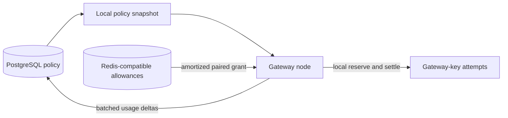

# Budgets, usage, and rate limits

## 1. Enforcement boundary

OwlRora applies operational consumption policy. It is not a financial ledger.

OwlRora owns:

- one overall monetary budget for every Gateway API key;
- one organization-scoped origin budget for system-provided attempts and one for organization-BYOK attempts;
- a required Gateway-key route allowlist and optional Gateway-key rate/concurrency policy;
- pre-dispatch cost estimation and approximate admission;
- attempt usage extraction and price calculation;
- compact usage aggregates and remaining-policy estimates.

An embedding platform owns billing periods, payments, credits, refunds, subscriptions, invoices, top-ups, and customer-facing balances. It changes OwlRora limits or accounting epochs through audited management commands.

Only a Gateway API key is a quota-bearing request principal. Direct trusted-JWT LLM requests still require issuer/token ceilings, an active local user and membership, explicit organization selection, and route eligibility, and their usage is still recorded, but OwlRora does not fabricate a key or apply Gateway-key/origin-pool budget, rate, or concurrency policy to them. A deployment that requires quota enforcement issues Gateway API keys and may disable direct-JWT LLM access at the trusted issuer.

Budget decisions are intentionally approximate. Provider usage can be late, absent, duplicated by retry, or different from estimates; distributed allowance can drift during node/Redis failure. OwlRora reports this uncertainty rather than claiming payment-grade accounting.

## 2. Route groups and accounting origin

A client-visible model is a first-class `ModelRoute`, not a provider alias. One route may group multiple interchangeable `RouteTarget` values with priority, weight, affinity, health, retry, and failover policy. An organization route may mix:

- granted system `ModelDeployment` targets backed by administrator-provisioned credentials; and
- same-organization `ModelDeployment` targets backed by organization BYOK credentials.

Both target classes have the same routing, capability, reliability, streaming, state-affinity, usage, and observability behavior. Their only budget distinction is the immutable deployment origin derived from deployment scope:

```text
system deployment       -> system_provided origin
organization deployment -> organization_byok origin
```

`origin_class` is derived runtime data, never a caller- or route-editable label. A retry or failover can move between origin classes when route policy permits. Every actual attempt is charged to the origin class of the target selected for that attempt; the logical request does not choose one origin budget in advance.

Every Gateway API key has a required, explicit, non-empty allowlist of stable organization-visible route IDs. The allowlist authorizes the complete route group, not provider prefixes, upstream model strings, individual hidden targets, or mutable display names. Normal route capability and grant checks can only narrow it. Adding a target to an already allowlisted route therefore requires the route update's ordinary authority, validation, ETag, audit, and propagation; it does not silently create another key allowlist entry.

## 3. Monetary representation

Calculated cost uses integer `cost_nanos`, where one unit is `10^-9` USD.

- Intermediate arithmetic is checked integer or exact decimal.
- Admission estimates round upward.
- Provider usage and pricing absence produce unknown cost, not zero.
- APIs serialize monetary values as decimal strings with currency and scale metadata.
- USD is the budget currency. OwlRora performs no foreign-exchange conversion.

## 4. Pricing policies

A versioned `PricingPolicyVersion` maps typed usage dimensions to cost:

```text
PricingPolicyVersion {
    id,
    version,
    currency,
    dimension_prices,
    rounding_rule,
    effective_metadata,
}
```

Dimensions may include input/output/cache/reasoning tokens, requests, seconds, and provider-specific units. Every attempt captures the deployment's immutable pricing version before dispatch. Later price changes do not rewrite in-flight or historical results.

Missing pricing for a reported billable dimension makes cost unknown and emits an accounting anomaly.

## 5. Two-layer budget model

A Gateway-key attempt is evaluated against exactly two monetary policies:

1. the key's overall budget, shared by all of that key's routes, targets, origins, retries, and failovers; and
2. exactly one organization origin budget selected from the actual attempt target.

The origin budgets are collective across all Gateway API keys in the organization:

| Origin policy | Applies to | Configuration authority |
| --- | --- | --- |
| `system_provided` | attempts using granted system deployments | system administrator assigns a limit to the exact organization |
| `organization_byok` | attempts using same-organization BYOK deployments | organization owner/admin configures its own limit within deployment ceilings |

A system administrator may also configure the BYOK ceiling but does not become the owner of BYOK credentials. Organization actors may read the effective system-provided allocation and its state but cannot expand or reset it. A key creator has no special budget authority. Creating an organization also creates both stable origin-policy rows in `suspended` state with no active version. The initial state is an explicit deny until the appropriate authority publishes a finite version; a missing row after initialization is an integrity fault, not an unlimited policy.

Stable policy resources are typed rather than inferred from a generic scope string:

```text
GatewayKeyBudgetPolicy {
    id,
    organization_id,
    gateway_api_key_id,
    desired_version_id,
    active_version_id?,
    status,
}

OrganizationOriginBudgetPolicy {
    id,
    organization_id,
    origin_class: system_provided | organization_byok,
    desired_version_id,
    active_version_id?,
    status,
}

BudgetPolicyVersion {
    id,
    policy_id,
    generation,
    mode: enforce | record_only,
    limit_cost_nanos,
    epoch_id,
    estimate_policy,
    allowance_policy,
    coordination_failure_mode,
    recovery_allowance_per_incident,
    recovery_allowance_per_epoch,
}
```

Every active Gateway key references exactly one key budget policy with a finite limit and epoch. A Gateway-key attempt also requires an active policy for its derived organization/origin pair. Absence, suspension, or an unready enforcing policy makes that target budget-ineligible; routing may try another eligible target. A `record_only` policy keeps its finite limit as an operational threshold but never denies or requires coordinator allowance. It reports threshold crossing, unknown-cost exposure, and aggregate lag explicitly.

Policy payloads are immutable versions. A pending desired version never overwrites the still-active payload; activation moves the stable policy pointer only after the matching coordinator generation is staged and armed without retiring the prior active generation. Coordinator-backed rate and strict-concurrency policies use the same handshake. A `record_only` version changing from another `record_only` version activates durably without Redis because it grants no spend authority. Any transition to or from `enforce`, and every coordinator-backed rate or strict-concurrency generation, uses staged/armed activation.

An `epoch_id` is an opaque accounting interval controlled externally. OwlRora does not schedule billing resets. Management operations distinguish:

- changing a limit or mode within the current epoch;
- beginning a new epoch with zero new enforcement counters;
- suspending an enforcing policy while state is uncertain;
- moving between `enforce` and `record_only` through a versioned audited update.

Old aggregates and in-flight attempt attribution retain their captured epochs. A key epoch and the selected origin-pool epoch are independent identifiers; an attempt records both.

## 6. Cost estimation

Before each dispatch attempt, the protocol/transport pair estimates a conservative request cost from:

- bounded input size or adapter-approved token estimate;
- effective maximum output;
- selected deployment pricing;
- fixed and feature-specific dimensions known before dispatch.

The estimate is an admission signal, not provider billing truth. An enforcing policy chooses one of:

- `require_estimate` — reject the candidate when no finite estimate exists;
- `fixed_unknown_reservation` — use a configured conservative fallback.

A record-only policy admits unknown estimates and records the uncertainty. If either the key or selected origin policy enforces, the candidate must satisfy every enforcing estimate rule and reserve the required amount before dispatch.

Each retry/failover attempt receives its own estimate because failed attempts may be billable. A request may skip a candidate that cannot satisfy its key/origin estimate policy or reserve its target-specific amount and continue through the bounded deterministic order. Strict-origin continuation requests cannot move to another target merely to find a different budget pool.

## 7. Distributed allowance architecture

Redis-compatible storage coordinates coarse enforcing allowances rather than acting as a per-request ledger. A standalone Redis deployment is supported; Redis Cluster, replication, or a managed high-availability service is recommended for production availability but is not required by OwlRora.



### 7.1 Paired allowance grants

A node obtains a bounded `AllowanceGrant` for one Gateway key and one organization origin pool:

```text
AllowanceGrant {
    organization_id,
    gateway_api_key_id,
    gateway_key_policy_generation,
    gateway_key_epoch_id,
    origin_class,
    origin_policy_generation,
    origin_epoch_id,
    node_instance_id,
    gateway_key_amount?,
    origin_pool_amount?,
    granted_at,
    expires_at,
}
```

An amount is present only for a policy in `enforce` mode. At least one amount is present or no coordinator grant is needed. Redis atomically allocates every present amount from organization-colocated counters. In Redis Cluster, keys use one organization-qualified hash tag so a paired operation remains within one slot; OwlRora never requires cross-slot atomicity. Allocation immediately charges the full grant against each enforcing distributed limit.

A grant is specific to the key/origin-policy pair. A route that can use both system and BYOK targets can therefore draw from two local paired grants while retaining one shared key counter. Atomic Redis allocation prevents either origin path from bypassing the key's overall remaining amount. Grant size is bounded by absolute and percentage ceilings for both policies, so one node cannot conservatively consume a large fraction of either budget unnecessarily.

Requests reserve and settle against the node's local grant without a Redis round trip. When actual cost is below the estimate, the difference returns to the same local grant. The node requests another grant when either relevant local amount crosses a threshold. Requests are singleflight/coalesced by exact policy pair so concurrent traffic does not stampede Redis. An estimate larger than a slice ceiling uses one atomically charged request-sized one-shot grant within every enforcing remaining limit, or the candidate is denied.

A live node periodically or on graceful grant close returns its final unused amount through an idempotent Redis operation. Grant expiry stops spending but does not automatically restore an unreturned amount: after node crash, each unreturned remainder is conservatively treated as consumed for its epoch. Actual cost exceeding an estimate consumes remaining local allowance, records debt against every enforcing policy when necessary, and blocks later local admission until the debt is covered or an administrative epoch change occurs.

Record-only policies use the bounded aggregate pipeline and do not receive spend authority from Redis. Their displayed usage can lag and never masquerades as an exact remaining balance.

### 7.2 Redis state and failure

Redis stores only bounded coordinator execution state:

- active plus staged/armed policy generation/epoch identifiers, candidate fences, and dual-generation acceptance sets;
- prior-generation retirement cutoffs and finalization markers;
- shared same-epoch budget/rate/concurrency ledgers and captured bounded policy parameters;
- allowance charged at grant creation and idempotently returned when proven unused;
- bounded current/retired grant identities, leases, settlement/return metadata, and receipts;
- optional shared health and state-origin data.

PostgreSQL remains policy and aggregate authority. Redis persistence and replication are recommended, but Redis state is not treated as a financial record.

Each enforcing policy explicitly chooses coordination failure behavior:

- `deny` — no new allowance is available;
- `bounded_local` — an eligible already-running node may spend a Redis-issued emergency grant it already holds.

An `EmergencyGrant` uses the same paired policy identities, epochs, node identity, charging, and idempotent-return model. Redis issues it only while healthy and charges every included amount immediately. A process that starts or restarts while coordination is unavailable has no grant and denies affected admission. Newly scaled replicas likewise deny until Redis issues and charges their grants. Consumed or stranded emergency amount remains charged, so restart and repeated outages cannot recycle budget.

The deployment configures `max_emergency_nodes` and fleet-wide reserve ceilings. With per-node amount `E_p` for policy `p` and cohort bound `N`, at most `N × E_p` may be uncertain or stranded for that policy, already included in charged consumption. This trade-off is visible in management status and telemetry. Redis degradation does not make unrelated gateway capabilities unready.

A verified restore may retain generations and counters only when recovery proves that no coordinator state was lost. Actual or uncertain loss installs new recovery generations and fences old local/emergency grants after bounded propagation.

Before installing a recovery generation, PostgreSQL atomically records one `CoordinatorRecovery` per affected enforcing policy:

```text
CoordinatorRecovery {
    policy_id,
    epoch_id,
    recovery_generation,
    incident_id,
    allowance_authorized,
    cumulative_epoch_allowance,
    reason,
    created_at,
}
```

The new Redis counter starts with only `allowance_authorized`, not the apparent full remaining budget. Repeated loss can authorize only the unused part of each durable per-epoch cap. A paired key/origin recovery allocation succeeds only when both enforcing policies have authorized amounts; a zero allowance on either side denies that target. PostgreSQL aggregates and checkpoints inform diagnostics but never reconstruct an exact balance.

### 7.3 Policy activation and generation

Every coordinator-backed budget or combined Gateway-key request-limits policy has a durable `PolicyActivation` record. Its identity is the pair `(policy_kind, policy_id)`; the policy kind selects exactly one budget or request-limits table and prevents ambiguous cross-family IDs:

```text
PolicyActivation {
    id,
    policy_id,
    epoch_id,
    desired_version_id,
    desired_generation,
    active_version_id?,
    active_generation?,
    prior_active_generation?,
    state:
        desired | coordinator_staged | coordinator_armed |
        active | finalized | superseded | failed,
    tightening,
    activation_deadline?,
    prior_generation_cutoff?,
    coordinator_fence,
    error_class?,
}
```

Redis separates staged metadata from allocatable generations and supports a bounded dual-generation transition. Installing a candidate MUST NOT replace or disable the PostgreSQL-active generation.

Activation is a recoverable handshake:

1. under the policy row lock, write one immutable desired version and strictly increasing generation without replacing active state;
2. for tightening, write a runtime-consumable `activation_pending` marker and deadline;
3. stage the desired epoch/generation and counter basis in Redis under a unique fence while the prior generation stays allocatable;
4. persist `coordinator_staged` only if desired generation and fence still match;
5. arm the candidate through fenced Redis compare-and-swap without retiring the prior generation;
6. persist `coordinator_armed` only while the exact candidate still matches;
7. atomically publish the durable active pointer and runtime configuration journal record;
8. nodes stop new spending from prior local grants after applying the generation and return proven-unused amount asynchronously;
9. only after durable activation, install a bounded prior-generation retirement cutoff and finalize after acknowledgements or cutoff.

During a same-epoch dual-generation window, generations share one monotonic scope ledger; they do not receive duplicate remaining budget, rate refill, or concurrency capacity. A crash before durable activation leaves the prior generation allocatable. A crash after activation resumes retirement. Expansion may remain pending without disabling prior active policy, while a missed tightening deadline fails closed.

Redis accepts idempotent return/settlement for exact retired grants without authorizing new allocation. After uncertain state loss, old receipts cannot reopen balance. A same-epoch limit change carries charged/returned state forward and may block grants immediately when the new limit is below consumption.

## 8. Request-local reservation and settlement

An enforcing Gateway-key attempt reserve:

1. verifies the key and origin policy generations and grant expiry;
2. checks every present key/origin local amount;
3. decrements those amounts atomically in local state;
4. records one bounded reservation containing both policy identities and epochs.

Settlement classifies:

- `actual` — consume calculated attempt cost and return estimation excess to the same grant;
- `definitely_not_dispatched` — return the estimate;
- `unknown_or_ambiguous` — consume the estimate;
- `actual_above_estimate` — consume additional amount or record local debt.

The same calculated attempt cost is attributed to the key budget and selected origin budget; this is two enforcement views of one spend, not two costs added together. A retry creates a distinct reservation and may select the other origin class.

Settlement is process-idempotent. Abrupt crash can lose local settlement detail, but the full distributed grant was already charged, so unreturned allowance remains conservative. Provider attempt usage still enters best-effort aggregates and telemetry when known.

For each enforcing policy `p`, let `N` be its emergency-node bound, `E_p` its per-node precharged reserve, `I` the maximum concurrently dispatched attempts that can charge it, and `U_p` the finite maximum actual-cost excess over one reservation. Emergency uncertainty is at most `N × E_p`; spend beyond precharged grants is bounded by `I × U_p`. A policy without finite `U_p` cannot claim a hard drift bound and must use a conservative fixed reservation, deny, or switch explicitly to record-only.

For same-epoch tightening, stale-policy spend is bounded by the old generation's globally remaining amount at desired commit plus `I × U_p`. Let `R_epoch,p` be the durable automatic recovery cap. Worst-case recovery adds at most `R_epoch,p + I × U_p` for that policy's epoch. Management displays each key and origin bound separately rather than summing them as duplicate monetary spend.

## 9. Usage attribution

Every attempt delta carries, where applicable:

- organization ID;
- user ID only for a JWT/local-user principal, never copied from a Gateway key's creator;
- gateway-key ID only for Gateway-key requests;
- key budget policy and epoch only for Gateway-key requests;
- derived `origin_class`, origin budget policy, and epoch only for Gateway-key requests;
- logical request and attempt IDs in transient evidence;
- protocol, route, target, deployment, endpoint, and credential-safe identifiers;
- pricing version, typed provider usage, known/unknown calculated cost;
- served/superseded/failed outcome and admission/settlement buckets.

Retries and failed attempts count separately from logical requests. Renames never rewrite historical identifiers. JWT attempts record target origin for analytics but have no fabricated origin-budget consumption.

## 10. Compact aggregates

OwlRora persists sparse hourly aggregates and optional daily rollups rather than raw request rows.

Two fact families prevent retry inflation:

- **logical request facts** — one terminal delta per logical request, keyed by organization, principal kind, optional user, optional Gateway key, route, protocol, outcome, and bucket;
- **attempt facts** — one terminal delta per upstream attempt, additionally keyed by target, deployment origin, deployment, endpoint, pricing version, applicable policy epochs, and attempt outcome.

Measures include counts, known and unknown cost, typed usage, retry/failover counts, and bounded latency histograms.

In-process maps merge identical keys and flush idempotent batches using `(source_epoch, batch_sequence)` receipts. Abrupt process loss may drop a bounded analytics window. This is reported and does not get silently reconciled into a false exact budget balance.

## 11. Gateway-key rate limits

Rate policies apply only to Gateway API keys and use token-bucket semantics for logical requests plus optional conservative input units. There is no organization-wide or JWT rate counter fabricated by OwlRora.

Distributed operation follows the same allowance pattern:

- Redis grants bounded tokens for one exact Gateway key;
- nodes consume tokens locally;
- refill metadata and grant expiry bound drift;
- a strict per-request Redis token bucket may be configured when stronger precision is worth the coordinator load.

Protocol-compatible `Retry-After` and safe remaining estimates may be returned. Provider rate-limit headers affect upstream reliability and do not mutate Gateway-key counters.

## 12. Concurrency limits

Three distinct mechanisms exist:

1. **node overload protection** — local process/task/connection limits applying to all traffic;
2. **target protection** — local endpoint/deployment in-flight ceilings used by routing for all traffic;
3. **Gateway-key concurrency policy** — optional approximate or strict limit for one key.

Gateway-key concurrency is approximate by default through bounded per-node slots. Strict mode acquires one Redis lease per request and intentionally pays per-request coordinator load. Streams have finite maximum duration, leases use coordinator time, and the request ends before lease reclaim. Direct JWT requests have no Gateway-key concurrency identity; they remain subject to node and target protection.

## 13. Admission order

For a Gateway-key request, the path applies:

1. authentication, organization qualification, required non-empty route-allowlist match, route authorization, and static request-capability eligibility;
2. cheap local size and process-overload checks;
3. Gateway-key logical-request rate-token consumption;
4. Gateway-key local or strict distributed concurrency acquisition;
5. strict continuation-origin lookup when requested;
6. bounded candidate ordering plus target capacity, pricing/estimate, required key budget, and derived system/BYOK origin-budget reservation;
7. upstream dispatch.

Unknown continuation state therefore consumes key request-rate allowance and releases key concurrency instead of generating unmetered coordinator reads. A later attempt repeats target capacity and both attempt-budget checks but not logical-request rate consumption. Terminal cleanup releases concurrency and settles cost.

A direct JWT request follows the same authentication, membership, route, overload, continuation, target-capacity, and dispatch ordering but skips Gateway-key route allowlist, rate, concurrency, and monetary budget steps. Its usage remains attributed to its user/organization and selected target.

## 14. Management semantics

The control plane supports coarse policy updates, explicit new-epoch commands, suspension/recovery, and aggregate queries.

- Omitted update fields remain unchanged.
- `null` clears nullable fields.
- Non-null values replace fields after full policy validation.
- New epoch is an explicit idempotent command because it changes counter identity.
- API and console use “change limit” and “begin epoch,” not commercial “top up” or “reset balance.”
- Gateway-key route allowlists are ordinary key policy updated with the key ETag, not budget dimensions.
- System-provided origin budgets require system-administrator authority even though they are qualified by organization ID.
- BYOK origin budgets require organization budget authority and remain bounded by deployment ceilings.

Every policy and recovery command is audited. Views keep key overall usage, system-provided pool usage, BYOK pool usage, desired/staged/armed/active/finalized state, local outstanding grants, Redis generation/topology/health, recovery allowance, calculated drift, checkpoint time, and analytics completeness separate. A mixed route never displays one apparent balance that hides which target origin would fund the next attempt.
