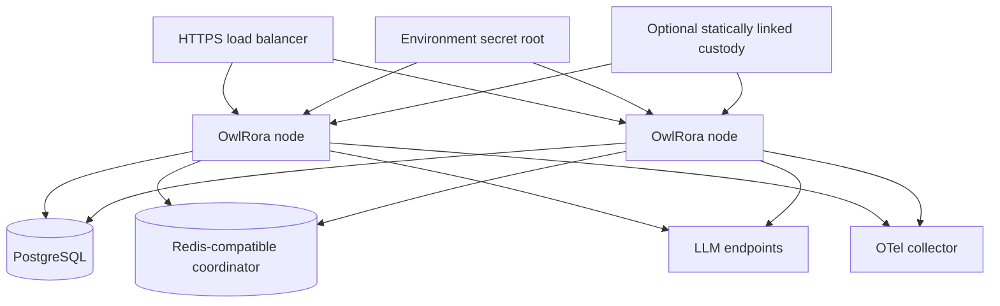

# Operations, security, and deployment

## 1. Deployment model

OwlRora is one self-contained Rust server with embedded React assets. Identical nodes run behind a load balancer and require no load-balancer session affinity.



Control-plane, data-plane, secret-controller, and background-worker roles share code and domain contracts. Deployment profiles may disable roles on selected replicas without creating a distinct service architecture.

## 2. Deployment profiles

### 2.1 Development

- one server process;
- PostgreSQL;
- optional in-process or local Redis coordinator;
- explicit `OWLRORA_SEED_ADMIN_API_KEY` for every management-enabled process;
- explicit `OWLRORA_SECRET_ROOT` environment value for the official binary;
- optional local OTel collector;
- explicit loopback upstream endpoint allowance.

Development secret encryption still requires an explicitly supplied/generated key. There is no compiled, deterministic, or silently generated fallback key.

### 2.2 Production single node

- one non-root server;
- durable PostgreSQL and tested backups;
- TLS at a trusted reverse proxy or documented native mode;
- explicit high-entropy `OWLRORA_SEED_ADMIN_API_KEY` on management-enabled processes;
- explicit `OWLRORA_SECRET_ROOT` environment value, or a custom statically composed custody implementation;
- Redis when distributed allowance/state features are needed;
- optional but recommended OTel collector.

### 2.3 Production multi-node

- two or more OwlRora nodes;
- shared PostgreSQL;
- shared Redis-compatible coordination; Redis Cluster or a managed high-availability deployment is recommended but not required by OwlRora;
- the same seed-administrator management API key on every management-enabled node;
- the same environment root or custom custody authority across nodes;
- external telemetry collector;
- rolling migration and versioned snapshot compatibility.

Cross-region guarantees depend on the selected PostgreSQL, Redis, and optional custom-custody consistency/latency design and are not inferred from the OwlRora process topology.

## 3. Configuration classes

1. **Runtime configuration** — listeners, PostgreSQL/Redis, telemetry, secret-custody composition, network policy, and seed-administrator authority.
2. **Managed product configuration** — users, scoped management keys, organizations, issuers, credentials, endpoints, deployments, routes, and policies in PostgreSQL.
3. **Secret material** — database passwords, upstream credentials, OAuth tokens, the seed-administrator management API key, and the software-encryption root.

Precedence and source are explicit. Unknown keys fail in strict mode. Diagnostics expose only safe source/type/key-ID metadata and never environment dumps or secret values.

## 4. Seed-administrator management key

Every management-enabled server process requires `OWLRORA_SEED_ADMIN_API_KEY`. It contains a normal versioned OwlRora management API key with at least 128 bits of random lookup identity and at least 256 bits of CSPRNG secret entropy. The server never silently generates a value, derives it from another secret, accepts a low-entropy passphrase, or provides a compiled fallback.

At startup the process validates the canonical management-key wire format and derives exactly one value:

```text
seed_admin_key_version_id =
    SHA-256("owlrora/management-api-key/seed-admin/v1\0" || canonical_decoded_key_bytes)
```

Direct authentication strictly parses the presented wire value, rejects non-canonical encoding, reconstructs the exact same `canonical_decoded_key_bytes` serialization used at startup, derives the same domain-separated value, and compares it in constant time. It never hashes the textual prefix/separators/base64url representation as a different byte sequence. A key-derived browser session stores the same `seed_admin_key_version_id`. It is not accepted as wire-format key material and recovering the raw key from it requires breaking the high-entropy preimage, so no second verifier/fingerprint construction is needed. All nodes derive the same value from the same key; rotation changes it and invalidates old sessions without load-balancer stickiness or process-local generation state.

The raw key and decoded key bytes never enter PostgreSQL, Redis, files, logs, audit, telemetry, diagnostics, panic output, command output, or API responses. The derived value remains in redacted process configuration and may appear only in the protected session record required for rotation checks; list/detail APIs do not expose it. Audit and telemetry identify only the fixed seed-key identity, `seed_admin`, and direct-key or key-session origin; `seed_admin_key_version_id` MUST NEVER appear in audit, telemetry, diagnostics, logs, or an API response.

A valid key establishes the built-in API-key-only `seed_admin` user through either:

- `Authorization: Bearer <management-api-key>` on versioned management requests, including `/api/v1/system/operations/**`; or
- the TLS-only management-key browser exchange that creates an opaque secure key-derived session without returning or persisting the key in frontend storage.

The configured key carries the complete concrete management scope set and fixed deployment-wide resource scope. It is not a `GatewayApiKey`, has no durable resource row, has no LLM scopes, is never accepted on LLM compatibility routes, and does not create gateway-key budget or LLM usage attribution. It enters the same typed authorizer as every other credential; the built-in user supplies fixed system-administrator capabilities. Every accepted operation records `seed_admin`, the fixed seed key identity, and the direct-key or key-session method. A rejected attempt records only sanitized attempted-method evidence because no user was authenticated.

`seed_admin` can operate the deployment directly or grant `SystemAdministratorGrant` to an existing active local user or deployment-owned Management API key. Operators should use the seed key for initial configuration and recovery, then prefer revocable deployment/organization Management keys for routine CLI/MCP automation and exact resource-principal attribution. There is no one-time bootstrap mode and no requirement that at least one local-user administrator continue to exist.

Rotation replaces the deployment secret and restarts or rolls every management-enabled node. Key-derived seed sessions fail when their stored version ID no longer matches the receiving node. OwlRora retains no previous-key ring or automatic overlap for the deployment key. During a mixed-key rollout, operators drain or isolate management traffic until all nodes use the new key; LLM traffic is unaffected. Host/database break-glass recovery remains separate, explicit, and high-severity audited.

## 5. Secret classes

Secrets are divided by whether OwlRora must recover plaintext.

### 5.1 Non-recoverable bearer values

Durable management API keys, gateway API keys, invitation tokens, and session IDs where compatible are high-entropy server-generated values stored as domain-separated SHA-256 digests. They are never encrypted or recoverable.

The operator-supplied seed-administrator management key is also non-recoverable by OwlRora, but it is not stored in the database at all; its deployment-secret handling and in-process verifier are defined in section 4.

### 5.2 Recoverable upstream secrets

Static provider keys, upstream or identity-provider OAuth access/refresh/ID tokens, device-authorization polling bearers, OpenID Connect confidential-client secrets, service-account documents, and other external material required for upstream calls or login completion use one of:

- encrypted PostgreSQL secret records;
- environment-variable reference;
- mounted-file reference;
- workload identity with no static secret stored by OwlRora.

Database secret plaintext never cohabits safe endpoint/deployment configuration JSON.

## 6. Secret encryption and custom custody

### 6.1 Bundled software encryption

The official OwlRora binary directly encrypts database-managed secrets with one deployment-supplied 32-byte root from `OWLRORA_SECRET_ROOT`. The environment value uses one documented canonical encoding and must decode to exactly 32 bytes. It never enters PostgreSQL, DTOs, diagnostics, logs, telemetry, panic output, or CLI output.

A singleton PostgreSQL `SystemInstallation` row contains one CSPRNG UUID `installation_id`. It is created exactly once during first schema initialization, is immutable through every application API, is read identically by all replicas, and is included automatically in PostgreSQL backup/restore. A restore preserving this row is the same OwlRora installation security domain. A separately initialized installation has a different ID, so copying an envelope and root into it does not authenticate. Deliberately forking a restored database into a new security domain requires an isolated, audited open-and-reseal migration using the source identity/root and a newly generated installation ID/root; changing either value without resealing fails closed.

HKDF-SHA-256 with a fixed versioned extract salt and distinct length-delimited `info` labels derives a 32-byte configuration-secret key. The baseline `software-xchacha20-poly1305-v1` envelope uses a fresh CSPRNG 24-byte nonce for every encryption and authenticates a canonical, versioned, length-delimited context containing at least:

- the immutable PostgreSQL `installation_id`;
- system or organization scope;
- protected-material ID;
- owner resource kind and immutable ID;
- owner generation and secret version;
- secret field purpose;
- custody provider ID and format version.

The protected record contains only stable server metadata and one bounded opaque envelope:

```text
ProtectedSecretVersion {
    id,
    scope,
    owner_kind,
    owner_id,
    owner_generation,
    field_purpose,
    custody_provider_id,
    provider_format_version,
    context_version,
    opaque_envelope,
    created_at,
}
```

For the bundled `software-xchacha20-poly1305-v1` format, the opaque envelope encodes the suite, nonce, and ciphertext. The exact context reconstructs `installation_id` from the singleton installation row and the remaining fields from the protected record/owner. Copying an envelope to another installation, organization, owner, field, generation, custody ID, or format fails authentication. There is no per-secret DEK, wrapped-DEK hierarchy, local key-provider object, key file, or KMS dependency in the official binary.

The official binary requires the environment root whenever bundled encrypted records may be created or opened. There is no compiled, fixed, passphrase-derived, silently generated, or encryption-disabled fallback.

### 6.2 Custom custody SPI

OwlRora follows the OwlAuth static-composition model. The small published `owlrora-key-provider` crate exposes provider-neutral, object-safe capabilities:

```text
ConfigurationSecretSealer {
    provider_id()
    supported_format_versions()
    seal(exact_context, bounded_plaintext) -> opaque_envelope
}

ConfigurationSecretOpener {
    provider_id()
    supported_format_versions()
    open(exact_context, opaque_envelope) -> bounded_plaintext
}
```

The SPI owns canonical bounded context values, redacted zeroizing plaintext wrappers, bounded opaque envelopes, provider IDs/format versions, and classified redacted errors. It owns no server policy, database, HTTP, configuration parser, OwlRora repository, or vendor SDK type.

The official distribution implements no AWS KMS, Google Cloud KMS, Azure Key Vault, Vault/OpenBao, HSM, or other remote adapter. A user or community crate may implement the SPI and statically compose trusted provider code into a custom OwlRora server binary through the public server builder. Custom configuration and SDK dependencies remain in that binary. OwlRora does not provide runtime dynamic-library loading, directory scanning, subprocess supervision, or a sidecar plugin protocol.

The reserved bundled custody ID is handled directly by the server's software-encryption module and is not a registered local provider object. Every custom `(custody_provider_id, provider_format_version)` dispatches to exactly one statically composed sealer/opener. Missing, duplicate, mismatched, oversized, or unsupported registrations fail at composition/readiness; a custom custody ID never silently falls back to bundled software encryption.

### 6.3 Runtime opening

Secrets are opened while constructing or refreshing a typed upstream credential client, never inside each LLM request.

- plaintext is held in bounded redacted non-serializable wrappers;
- clients are keyed by credential ID and secret version;
- caches are bounded and invalidated on rotation/revocation;
- debug, clone, error, audit, panic, and telemetry paths expose only redacted metadata;
- plaintext is not inserted into immutable general configuration snapshots;
- memory zeroization is used where Rust types and provider SDK ownership permit it, without claiming protection from a fully compromised process.

A custom custody outage does not terminate already constructed clients. It blocks only operations that need to seal/open, including startup without loaded clients, new secret activation, provider-secret rotation, and Codex-token refresh requiring protected material.

### 6.4 Rotation and migration

Provider-secret rotation creates a new protected generation and publishes a new credential version. Cipher/context/provider-format migration opens one selected generation and seals it into a new format through bounded audited workers with short claims, retry/backoff, and idempotent version fencing.

The bundled software implementation has one static root and no online root rotation or retained root ring. Operators must not replace `OWLRORA_SECRET_ROOT` in place: every replica and restore requiring bundled records needs the same root. Online root rotation is a separate future design rather than a hidden multi-key fallback. A custom custody implementation may provide its own key lifecycle behind stable opaque envelope semantics without changing OwlRora domain records.

## 7. Codex OAuth secret lifecycle

Codex access, refresh, ID-token, provider `device_code`, and equivalent polling material use the same encrypted-secret service. Device-login secrets have bounded lifetime; completion, cancellation, or expiry physically deletes no-longer-needed ciphertext from the active database. Safe login/auth lifecycle status is stored separately from encrypted material and separately from administrative enable/disable status.

Refresh coordination uses PostgreSQL version/fingerprint plus a unique monotonically fenced lease token:

- one worker persists a unique refresh attempt before using the refresh token;
- its lease exceeds a hard provider-network deadline plus bounded commit margin, and provider I/O is cancelled before that margin;
- network calls run outside transactions;
- success or explicit failure commits only while the exact lease token, credential version, and old fingerprint match; a successful replacement activates the new protected version and deletes superseded token ciphertext that is no longer needed;
- stale results cannot overwrite a newer login/rotation;
- a lease that expires after the request may have reached the provider transitions to `refresh_outcome_unknown`; the old refresh token is not replayed unless the current Codex adapter contract documents safe reuse or upstream idempotency;
- due work is indexed by `next_refresh_at` and claimed in bounded batches;
- terminal authorization errors mark the credential expired, known transient errors use bounded backoff, and unknown outcomes require reauthentication;
- revocation attempts the upstream revoke operation where supported, then physically deletes no-longer-needed login/token ciphertext from the active database and retains only safe lifecycle/audit metadata.

The shared environment root provides no per-secret cryptographic erasure. A logically inactive ciphertext remains decryptable if retained with its exact context and root, so normal terminal cleanup deletes it rather than calling it cryptographically retired. Existing backups may retain old ciphertext until their declared expiry; operators include that exposure in backup access and retention policy.

Raw OAuth and device-flow bearers never enter configuration journals, Redis, browser JavaScript, logs, telemetry, or management responses.

## 8. Network security

### 8.1 Inbound

- Production management and LLM traffic uses TLS.
- Trusted reverse proxies are explicit address/CIDR entries; other forwarded headers are ignored.
- Body/header/path/time limits apply before expensive parsing.
- Management and LLM pools/bulkheads prevent starvation across surfaces.
- Ambiguous framing and hop-by-hop misuse are rejected.
- The console uses CSP, clickjacking, MIME-sniffing, and restrictive referrer protections.

### 8.2 Upstream egress

- Endpoints are administrator-controlled and validated against SSRF policy.
- DNS results are checked at connection time.
- Redirects are disabled by default.
- TLS hostname/certificate verification is mandatory; custom CAs are explicit.
- Metadata, link-local, and unapproved private addresses are denied.
- Proxies receive secrets only for an endpoint allowed by network policy.

### 8.3 Identity, custom custody, and telemetry egress

JWKS, OAuth, OTLP, and any statically composed remote-custody destinations have separate explicit HTTPS/network policy. Caller input cannot select or redirect them.

## 9. Authentication security

### 9.1 Management API keys

Management keys use secure randomness, a management-only versioned prefix, one-time reveal, local constant-time digest verification, bounded failure-rate controls, and snapshot-based scope/revocation checks. They are accepted only from the authorization header or the TLS-only browser exchange. Query-string and cookie-carried raw management keys are forbidden.

A management-key-derived session binds the accepted seed/deployment/organization key principal, key ID/version, and every scope/resource ceiling. Disabling, expiring, narrowing, or invalidating the key, tightening current deployment/organization key policy, revoking a deployment-key administrator grant, suspending its organization, or rotating the configured seed key rejects the session after the bounded security-propagation objective.

### 9.2 Gateway API keys

Gateway keys are organization-owned resource principals. They use secure randomness, a distinct LLM-only versioned prefix, one-time reveal, local constant-time digest verification, bounded failure-rate controls, and snapshot-based key/organization-policy revocation; creator user state is never consulted. Query-string gateway keys are disabled except an explicitly enabled Google compatibility mode and are scrubbed before any URL telemetry.

### 9.3 Trusted JWTs

JWTs require exact issuer, accepted audience, asymmetric algorithm allowlist, signature, time, stable subject, active binding, and current local authority. Token roles/groups/organizations do not bypass local grants. Browser login uses state/nonce and exchanges external tokens for an opaque local session.

### 9.4 Browser sessions

Sessions use high-entropy identifiers, secure HTTP-only cookies, bounded expiry/revocation, fixation prevention, origin validation, and CSRF protection. An OIDC-derived session stores only its issuer ID, concrete captured management scope set, and safe typed login capability/organization ceiling, not authorization codes, external tokens, or arbitrary claims. Each request intersects those captured ceilings with current issuer status/policy and current user authority; later scope/capability narrowing applies, while later expansion cannot widen the session without re-login.

## 10. Provider and content trust

Upstream responses are untrusted:

- headers and frames are bounded and parsed defensively;
- error bodies are sanitized;
- usage values are checked for type, sign, and overflow;
- provider URLs/files are not fetched implicitly;
- prompts and responses are not logged;
- OwlRora does not claim content safety/DLP unless separately specified.

The server loads no untrusted native or WebAssembly provider plugin code.

## 11. Process isolation

- Production container runs non-root and drops unnecessary capabilities.
- Root filesystem is read-only where supported.
- Writable paths are explicit, bounded, and permissioned.
- Docker socket and host namespaces are not required.
- Node.js and frontend build tools are absent from runtime images.
- Temporary secret files are not created by normal database decryption.

## 12. Health and readiness

`GET /health` is cheap liveness and reveals only stable alive status.

`GET /ready` succeeds when:

- a valid runtime snapshot is loaded within security-age bounds;
- database schema compatibility is established;
- the process accepts new requests.

Redis, optional custom custody, OTel, and individual upstream health do not automatically make the whole node unready. Protected status reports affected capabilities:

- Redis outage may use bounded local/recovery policy or exhaust state-origin operations;
- custom custody outage blocks affected secret rebuild/rotation while already loaded clients may continue;
- one endpoint affects only dependent deployments/routes;
- collector failure affects export only.

A node that cannot load any required startup credential because its environment root is missing/wrong or custom custody cannot open it remains unready according to configured required-route policy.

## 13. Startup and shutdown

Startup:

1. validate runtime, seed-administrator management key, environment-root, and custom-custody composition;
2. verify PostgreSQL schema, the singleton immutable installation identity, and Redis/custom-custody capability status;
3. load, open, and build required credential clients;
4. compile one coherent runtime snapshot;
5. start journal, credential-refresh, aggregate, allowance, cleanup, and telemetry workers;
6. become ready.

Shutdown:

1. become unready and stop new work;
2. drain non-streaming and streaming requests under separate bounds;
3. cancel remaining upstream work;
4. return allowance/release strict leases and settle known state where possible;
5. flush aggregate/telemetry buffers under deadlines;
6. terminate without waiting forever on dependencies.

Forced shutdown may lose bounded approximate accounting and telemetry state; this is visible by design.

## 14. Dependency isolation

| Dependency | Behavior |
| --- | --- |
| PostgreSQL | required for startup/control; loaded data plane continues within snapshot-age bound |
| Redis | local allowance continues; later affected admission follows configured failure mode |
| environment root/custom custody | loaded clients may continue; affected open/seal/rebuild fails safely |
| OTel collector | bounded export degradation only |
| one endpoint/deployment | health, retry/failover, or route-scoped error |
| external identity issuer | affected JWT/login fails; local API-key traffic continues |
| change notification | journal polling preserves convergence |

Pools and bulkheads keep one failing dependency from exhausting all tasks/connections.

## 15. Migrations and upgrades

- PostgreSQL migrations are ordered and transactional where supported.
- Rolling upgrades use expand/migrate/contract compatibility.
- Runtime snapshot and encryption-envelope formats are versioned.
- Nodes reject unsupported formats rather than guessing.
- Cryptographic algorithm/key migration is distinct from schema migration.
- Adapter capability additions do not become active without configuration publication.

## 16. Backup and restore

Backups include:

- PostgreSQL protected envelopes, immutable `SystemInstallation.installation_id`, audit, and configuration;
- the exact `OWLRORA_SECRET_ROOT` recovery secret for bundled records, or custom-custody recovery procedures;
- environment/file credential sources through the operator's secret backup system; the seed-administrator key may be preserved or replaced independently because no durable data is encrypted by its value;
- current Redis recovery/checkpoint policy where approximate continuity matters.

A PostgreSQL backup without the exact bundled root or required custom-custody access is intentionally undecryptable. The root/provider access without database envelopes is insufficient. Restore drills validate both together.

Restore sequence:

1. isolate restored infrastructure;
2. restore PostgreSQL and the exact environment root or custom-custody access;
3. verify the restored immutable `installation_id`, envelope authentication, and required credential clients;
4. compile configuration and validate migrations;
5. restore a verified intact Redis generation, or install a new recovery generation with the bounded availability-first recovery allowance defined in spec 07;
6. start one node and inspect protected diagnostics;
7. add replicas and resume traffic;
8. audit the recovery.

## 17. Resource exhaustion and incident response

The server bounds request bodies, streams, JSON complexity, identity refresh, custom-custody calls, OAuth refresh, database pools, Redis grants, aggregate keys, telemetry queues, file descriptors, and tasks.

Operators can disable users, organizations, management keys, gateway keys, JWT issuers, upstream credentials, endpoints, deployments, routes, or policies; grant/revoke system administration for an active local user or deployment-owned Management-key principal; rotate provider secrets; revoke Codex OAuth state; force snapshot catch-up; rotate the seed-administrator key through coordinated deployment configuration; and invoke break-glass recovery.

Emergency actions favor fail-closed authorization and preserved evidence. They do not delete history or expose secret material.
