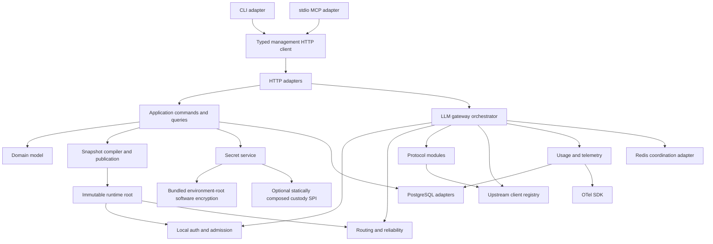

# Implementation architecture

## 1. Architectural form

OwlRora is a Rust modular monolith:

- one repository and versioned workspace;
- one deployable server executable and container;
- one PostgreSQL schema owned by the application;
- one optional Redis-compatible coordination port;
- one embedded React console;
- one official executable providing server, CLI, and local stdio MCP modes;
- one server package containing the product modules and management clients;
- one small published key-provider SPI package only because third-party custody implementations need a stable compile-time boundary.

The architecture avoids microservice network boundaries while keeping modules separable by dependency direction. High request volume alone does not justify a service split because the data plane already scales through identical server replicas.

## 2. Runtime composition



HTTP handlers are thin. Domain invariants do not live in route code. Upstream transports cannot bypass authorization, target selection, response commitment, usage evidence, or header policy.

## 3. Packages and modules

OwlRora does not split domain, control plane, gateway, protocols, secrets, and infrastructure into separate crates by default. They compile together in `owlrora-server`; module visibility and dependency rules provide the internal boundaries.

```text
crates/
  owlrora-key-provider/
    src/context.rs              bounded canonical protection context
    src/secrets.rs              object-safe seal/open capability traits
    src/values.rs               redacted bounded envelopes and plaintext
    src/error.rs                provider-neutral classified errors

  owlrora-server/
    src/domain/                 identity, tenancy, catalog, policy, usage, audit
    src/application/            commands, queries, ports, transactions
    src/gateway/                admission, routing, reliability, runtime, usage
    src/protocols/              Anthropic, OpenAI, Gemini, upstream transports
    src/secrets/                bundled environment-root software encryption
    src/adapters/               PostgreSQL, Redis, JWT/JWKS, telemetry
    src/http/                   management, compatibility, operations
    src/management_client/      typed public-HTTP client and operation descriptors
    src/cli/                    command families, profiles, and rendering
    src/mcp/                    typed stdio toolsets and MCP protocol adapter
    src/workers/                publication, credentials, aggregates, cleanup
    src/frontend/               embedded assets and SPA routing
    src/composition.rs          official and custom-provider composition
    src/lib.rs
    src/main.rs                 owlrora serve/CLI/MCP mode selection
```

`owlrora-key-provider` exists only as a small provider-neutral SPI for deployments that need custom secret custody. It contains no server, database, HTTP, configuration parser, vendor SDK, or OwlRora domain repository. The official server repository implements no AWS, GCP, Azure, Vault, HSM, or other remote provider crate.

The official `owlrora-server` binary composes the bundled software encryption implementation. A third party implements the SPI in an independent crate and statically links it into a custom binary through the public high-level server composition API. OwlRora does not scan plugin directories, load Rust dynamic libraries, supervise provider subprocesses, or define a sidecar protocol.

Gateway, management, worker, CLI, and MCP roles remain modules in the same package and `owlrora` executable. `owlrora serve` may run all server roles or only selected roles; `owlrora mcp` is a local stdio child process and CLI commands are bounded client invocations. Mode selection does not produce separate product crates, binaries, schemas, privileged in-process client paths, or network services.

The published `owlrora-key-provider` package is versioned and published before `owlrora-server`. The server embeds production frontend assets and requires no unpublished sibling path; workspace development may use a local path override, while packaged builds resolve the published SPI dependency.

## 4. Dependency direction

### 4.1 Domain and application

The `domain` and `application` modules own:

- validated identifiers and value objects;
- the built-in API-key-only `seed_admin` user plus local users, scoped management keys, gateway keys, organizations, memberships, credential metadata, endpoints, deployments, routes, targets, policies, usage, and audit entities;
- state transitions and invariant errors;
- command/query orchestration through narrow ports.

It knows no HTTP response, SQL statement, Redis command, cloud KMS SDK, provider SDK, or OwlAuth-specific schema.

### 4.2 Gateway runtime

The `gateway` module owns one logical LLM request lifecycle and consumes only:

- immutable principal/policy/catalog snapshots;
- typed protocol intent;
- upstream transport clients;
- allowance/state-origin ports;
- usage and telemetry sinks.

It never calls a SQL repository on the normal request path and never receives raw decryptable secret storage records.

### 4.3 Protocols and transports

The `protocols` module owns native payload, stream, error, usage, and adapter behavior. Shared types are limited to genuinely common routing intent, attempt metadata, bounded byte/frame streams, typed usage, and internal error categories.

There is no universal `ChatRequest`. Each registered `(ingress family, endpoint adapter, credential kind, transport kind)` combination has explicit fixtures.

### 4.4 Secrets and custom custody

The server `secrets` module owns bundled environment-root encryption, envelope format, canonical context construction, redacted wrappers, and secret lifecycle. The independent `owlrora-key-provider` SPI owns only bounded provider-neutral seal/open requests, opaque envelopes, exact context values, and redacted classified errors.

A custom provider implementation owns its vendor SDK and maps failures into the SPI error vocabulary. It is trusted statically linked code in a custom server binary and receives no provider credentials, routes, organizations, repositories, or HTTP DTOs beyond the exact secret-protection request.

Application services authorize and audit secret mutation, then call the selected sealer/opener capabilities. Protocol adapters receive already constructed credential clients and never call encryption or a remote custody service per LLM request.

### 4.5 Infrastructure and server

Adapter modules implement ports. `owlrora-server` composes them and translates HTTP/browser contracts to application requests. Management-key verification produces the built-in `seed_admin` principal or the exact durable deployment/organization Management-key resource principal plus key identity/version, resource scope, and ceiling as authentication evidence. It never resolves the durable key's creator as a local user. The HTTP adapter does not grant capabilities itself, and the ordinary application authorizer and audit orchestration remain mandatory.

The CLI and MCP adapters always use the typed public-HTTP client, even when installed beside a server. They cannot receive repositories, application services, deployment configuration, or raw in-process secret capabilities. Their operation inventory derives from the same checked descriptors as management OpenAPI.

No repository returns an Axum response. No HTTP handler embeds SQL or decides authorization. No custom custody provider decides authorization. No provider transport writes tenant policy.

## 5. Core ports

Representative interfaces are narrow and operation-oriented:

```text
TransactionManager
UserRepository / OrganizationRepository / MembershipRepository
GatewayKeyRepository
CatalogRepository / PolicyRepository
AuditRepository / ConfigurationJournalRepository
RuntimeSnapshotSource
CredentialSecretRepository
ConfigurationSecretSealer / ConfigurationSecretOpener
CredentialClientFactory
ExternalIdentityVerifier
AllowanceCoordinator
StateOriginStore
SharedHealthStore
ProviderTransport
UsageAggregateSink
TelemetrySink
Clock / IdGenerator
```

Ports model atomic domain operations rather than exposing one generic CRUD or key-value interface.

## 6. Logical request orchestrator

```text
Received
  -> Parsed
  -> Authenticated
  -> OrganizationQualified
  -> Authorized
  -> CandidatesOrdered
  -> Admitted
  -> Attempting(n)
  -> ResponseCommitted?
  -> Completed | Rejected | Failed | Interrupted
  -> SettledAndObserved
```

Ownership is explicit:

- protocol module parses and renders;
- admission establishes immutable principal and policy context;
- router returns deterministic candidates from one snapshot/health view;
- reliability executor owns attempt transitions and commitment;
- transport executes one upstream attempt;
- allowance module reserves/settles approximate or strict policy state;
- usage calculates attempt cost from captured pricing;
- telemetry observes typed outcomes and never determines correctness.

Structured cancellation and terminal guards ensure concurrency release and best-effort settlement run on every exit path.

## 7. Runtime generation

One atomically replaceable `RuntimeGeneration` contains:

1. `RuntimeSnapshotRoot` — serializable-safe identity, policy, catalog, and key-digest state;
2. `CredentialClientRegistry` — non-serializable redacted upstream clients keyed by credential ID/version and endpoint binding.

A candidate publication builds both outside the request path and performs one root-pointer swap only when every required reference is coherent. Immediately after bounded transport parsing, a request captures one generation and uses it for authentication, authorization, origin resolution, target selection, and matching client dispatch. That generation remains valid for its lifetime even if a new credential version publishes. There is no interval in which a request authenticates under one generation or a new catalog selects an old or missing client registry.

Secret opening and secret-source I/O occur only during generation build/refresh. Plaintext never enters snapshot debug output or configuration journal.

## 8. Background workers

Workers have bounded concurrency, explicit ownership, retry/backoff, cancellation, shutdown deadlines, and lag/error signals.

Worker roles include:

1. commit-ordered journal catch-up with MVCC-fenced snapshot publication;
2. full reconciliation under the same revision fence with jitter;
3. upstream credential client rebuild after secret/source changes;
4. rate-limited JWKS fetch, immutable verifier-material persistence, and publication;
5. Codex device-login and due-token refresh controller;
6. persistent staged/armed coordinator-policy activation, old-generation retirement, Redis allowance return/recovery, and shared-health publication;
7. usage aggregate flush and rollup;
8. session/invitation/idempotency cleanup;
9. provider validation and active health probes;
10. bounded protected-secret provider/format migration;
11. OTel export.

Network calls do not run inside database transactions. Distributed worker claims use indexed due rows, short leases, and version/fingerprint fencing rather than every node scanning complete tables.

## 9. Concurrency model

- Tokio serves requests and bounded workers.
- Atomic `Arc` roots make snapshot reads lock-free at request granularity.
- Local target health/in-flight state uses per-target or sharded synchronization.
- Provider clients and connection pools are reused by endpoint/credential/transport version.
- Streams use direct polling or bounded channels.
- Blocking database/crypto/SDK work uses appropriate bounded execution pools only when required.
- Cancellation propagates from client deadline/disconnect to upstream attempt and cleanup.
- Multi-lock paths document lock ordering; subtle algorithms use model/property/stress tests.

## 10. Error taxonomy

Typed layers remain distinct:

- `DomainError` — invalid state transition or invariant;
- `AuthenticationError` — unusable management API key/key-derived session, external session, JWT, or gateway API key;
- `AuthorizationError` — tenant, role, scope, or grant denial;
- `AdmissionError` — allowance, rate, concurrency, or overload denial;
- `RoutingError` — no compatible/healthy target or state-origin failure;
- `ProviderAttemptError` — typed endpoint/transport/provider outcome;
- `SecretError` — envelope, key-provider, source, refresh, or redaction-safe failure;
- `PersistenceError` — control/background infrastructure;
- `ProtocolError` — caller or upstream framing/schema issue;
- `InternalInvariantError` — corruption/bug requiring sanitized high-severity evidence.

Retries use typed categories, never string matching.

## 11. Testing architecture

### 11.1 Domain and property tests

Function-style unit/property tests cover:

- final-owner plus seed/granted-system-administrator authority invariants;
- JWT/local-principal convergence;
- scope and grant intersections;
- route graph and capability compilation;
- WRH canonical vectors and affinity;
- budget allowance arithmetic, activation crash recovery, outage restart behavior, and drift bounds;
- pricing and aggregate key semantics;
- update DTO tri-state behavior and uniform `ETag`/`If-Match` preconditions.

### 11.2 Cryptographic tests

Tests cover:

- bundled HKDF-SHA-256 and XChaCha20-Poly1305 vectors;
- envelope round-trip and canonical associated data;
- installation-ID, ciphertext relocation, purpose, owner, generation, and format substitution rejection;
- immutable installation-ID create/restore/fork vectors, fresh nonce generation, and environment-root validation;
- missing/wrong root, tamper, and format migration behavior;
- SPI object safety, bounded opaque values, exact-context dispatch, and third-party compile/composition fixtures;
- redaction across debug/error/serialization/telemetry.

The bundled implementation has no compiled, generated, or fixed fallback root.

### 11.3 Protocol contract tests

Versioned golden fixtures cover request, response, error, stream, unknown fields, usage, header policy, and every advertised adapter combination.

Codex fixtures cover the currently supported community contract, terminal active-database ciphertext deletion and backup-retention semantics, refresh lease expiry and unknown outcome, account header, Responses patches, 401 replay boundary, continuation, and WebSocket pinning where supported.

### 11.4 Infrastructure tests

Real PostgreSQL and Redis-compatible instances cover constraints, transaction races, forced reverse commit attempts around the revision-counter lock, contiguous commit-ordered journal watermarks, configuration MVCC/revision fencing, journal gaps, delta/full rebuilds, staged/armed dual-generation policy activation at every crash point, old-generation retirement, allowance grant drift, bounded automatic Redis-loss recovery, bounded-local restart denial, versioned state origin, versioned JWKS refresh/key removal and signature-cache invalidation, aggregate batch receipts, refresh leases, and migrations.

The SPI package has public compile fixtures proving an independent provider crate can statically compose a custom server without importing private server modules. OwlRora does not own vendor-provider integration tests because it ships no vendor provider.

### 11.5 End-to-end tests

The packaged server exercises:

- distinct management/gateway key prefixes and verifier indexes, built-in `seed_admin` identity, durable resource-key principal and current key-policy intersection without creator-user lookup, opposite-surface rejection, seed actor audit, cross-node key-version/session rotation, JWT/session identity, user/deployment-key system-administrator grants, and direct/synthetic tenant administration;
- credential, endpoint, deployment, route, policy, and key management through API, console, CLI, and MCP;
- CLI/MCP public-HTTP-only behavior, scoped/full toolsets, stdio purity, `ETag` conflicts, sensitive-result opt-in, and no ambiguous command replay;
- all native LLM protocols and streaming forms;
- Codex subscription login/refresh and Responses request;
- deterministic affinity, active/passive health, retry, failover, circuits, and strict continuation origin;
- approximate budgets/rates and optional strict concurrency;
- usage queries, OTel export, bundled encryption/custom-custody failure, revocation, and snapshot propagation;
- frontend navigation and one-time secret UX.

### 11.6 Fault and performance tests

Fault injection covers PostgreSQL, Redis, optional custom custody, OAuth, JWKS, endpoint DNS/TLS, provider error/stream truncation, collector, client disconnect, process crash, and shutdown.

Performance tests publish request mix and measure PostgreSQL/Redis operation rate, config-refresh amplification, secret-open calls, memory, allocations, locks, queues, and gateway-added latency. Profiling precedes service or database decomposition.

## 12. Boundary evolution

The default is to keep product modules inside `owlrora-server`. Beyond the key-provider SPI, a module becomes another crate only when an external implementation boundary, independently publishable API, or material dependency/security boundary makes the package split simpler than module visibility. It becomes a separate process only with measured evidence of:

- an incompatible resource/scaling profile;
- a required independent security or fault boundary;
- an independently operated lifecycle;
- a clean API and data owner that does not introduce distributed transactions.

Protocol breadth, frontend/CLI/MCP completeness, or ten million daily requests do not alone require microservices. The stable unit remains one complete OwlRora package and executable unless evidence proves otherwise.
