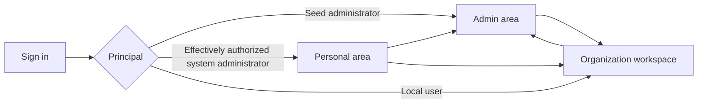

# Console information architecture

## 1. Product model

The embedded console is one management client with three contexts:

1. **Personal** — current principal, authentication origin, sessions, and local-user organization access;
2. **Organization** — one explicitly selected tenant and its delegated resources;
3. **Admin** — deployment-wide identity, tenants, catalog, policy, operations, and audit.

The layout borrows GitLab's context switch rather than building one flat administrator dashboard. The top bar establishes actor and current context. The left sidebar contains navigation only for that context. A granted system administrator can move between Admin and organization contexts without receiving an organization membership only when the current credential/session ceiling effectively permits the requested system or organization context. The built-in API-key-only `seed_admin` user starts in Admin and may open an explicitly named organization workspace through system authority.

The Admin link is shown only when `GET /api/v1/me` reports effective system-administrator capability for the current session after credential/session scope, resource scope, current key policy, and administrator-grant intersection. An organization Management-key session can never show or enter Admin, regardless of its creator. A deployment-key grant alone is insufficient when the key/session lacks the required scopes. The organization switcher lists only currently effective active memberships and exact organizations; a system administrator whose current credential permits broader organization access may additionally search and open an organization through explicit system authority. Those access reasons remain distinguishable in the UI and audit.

## 2. Entry and context selection

### 2.1 Root behavior

`/` resolves predictably:

- no authenticated principal: redirect to `/sign-in`;
- `seed_admin`: redirect to `/admin`;
- an organization Management-key session: redirect to its fixed organization overview;
- a local-user or deployment Management-key session with current effective system-administrator capability and no selected organization: redirect to `/admin`;
- otherwise, a local user with a remembered organization still allowed by both current authority and credential/session boundary: redirect to that organization overview;
- otherwise, a local user with exactly one currently effective organization: redirect to it;
- a local user with multiple currently effective organizations and no valid selection: show `/organizations`;
- a local user with no currently effective organization: show `/profile` with a clear empty state.

An organization Management-key session never redirects to `/admin` and never inherits its creator's grants; its only tenant is fixed by key resource scope. A deployment-key session requires its own active administrator grant and scopes rather than creator authority. The remembered organization is presentation state only and is reauthorized before redirect.

### 2.2 Sign-in

The sign-in page has two deliberately separate choices:

- **Continue with an identity provider** — one button per enabled browser-login issuer;
- **Use a management API key** — a form explaining that management keys are scoped control-plane credentials and are not LLM gateway keys.

The management key is entered in a non-autocompleting password control and submitted once to the same-origin, rate-limited session-exchange endpoint over TLS. After every success or failure, the form value is cleared; on success the browser retains only the secure HTTP-only session cookie. The resulting session preserves the seed/deployment/organization key principal, resource scope, and scope/capability ceiling. When the key authenticates `seed_admin`, the form clearly warns that it has full deployment management authority. The key is never placed in a URL, persisted by the frontend, or offered as an organization credential.

### 2.3 Actor presentation

The actor menu always shows one of:

- `Seed administrator` with authentication origin `Management API key session` and full fixed scope;
- deployment Management API key name with `Deployment automation`, effective scopes, and administrator-grant status;
- organization Management API key name with organization name, `Organization automation`, and effective scopes;
- local user display name with external issuer/session origin plus the captured/effective management-scope and organization-ceiling summary;
- local user display name with the applicable direct authentication origin where the console supports it.

`seed_admin` is rendered as a built-in API-key-only user, never as a durable local user, member, owner, email address, or Gateway-key principal. Resource-owned key sessions never display or impersonate `created_by_principal` as the actor.

`GET /api/v1/me` is the shell's authority source. It returns principal kind, safe key resource identity where applicable, authentication origin, effective management scopes/capabilities, allowed organization metadata, and effective system capability/grant status after current policy intersection. Navigation and redirects never infer authority from creator metadata, a grant, or membership alone.

## 3. Global shell

### 3.1 Top bar

The top bar contains:

- OwlRora product/home link;
- current context label and switcher;
- bounded active warnings for readiness, stale runtime, Redis coordination, secret custody, aggregate persistence, and telemetry;
- Admin-area entry when the current session has effective system-administrator capability;
- help/documentation entry;
- actor menu and sign out.

Warnings summarize capability impact rather than exposing raw dependency errors. They link to the relevant Admin Operations page for system administrators and to a safe organization-scoped explanation for tenant users.

### 3.2 Context sidebar

The sidebar is stable within each context and collapses to a drawer on small screens. It does not mix global catalog resources into an organization workspace or duplicate organization operations in the Admin sidebar.

Lists and detail pages use breadcrumbs beneath the top bar. Breadcrumb labels are safe display values; links retain stable opaque IDs.

## 4. Personal information architecture

The personal area is intentionally small and contains no API-key management:

- **Profile** — principal kind, local-user identity, external bindings visible to that user, and sign-in origin;
- **Organizations** — active memberships and role/scope summary for local users;
- **Sessions** — active browser sessions and revocation where supported.

Management and Gateway API keys are deployment/organization resources, never personal resources. Key sessions may view a safe actor/session summary under `/profile`, but management actions link to Admin or the fixed organization workspace.

For `seed_admin`, the personal page shows only built-in user identity, current key-derived authentication origin, session expiry, and deployment rotation guidance. Its configured key is not listable or mutable through the console. Membership, personal keys, invitations, and profile editing are not applicable.

## 5. Organization workspace

The organization sidebar contains:

1. **Overview**
   - request, failure, retry, token, and known-cost summaries;
   - separate Gateway-key overall, system-provider, and BYOK budget state plus key-rate warnings;
   - active warnings and recent safe activity.
2. **Members**
   - members, role/scope ceilings, invitations, and owner invariants.
3. **Management API keys**
   - organization automation principals, scopes/capabilities, creator attribution, create/reveal-once/rotate/update/disable, and CLI/MCP setup.
4. **Gateway API keys**
   - organization LLM service keys, scopes, required route allowlist, overall budget, optional key-rate/concurrency policy, creator attribution, create/reveal-once/rotate/update/disable.
5. **API key policy**
   - member-creation switches and per-class scope, route, active-count, overlap, and expiry ceilings.
6. **BYOK credentials**
   - same-organization provider credentials, write-only secret replacement, status, validation, and dependent deployments; no endpoint editing.
7. **Model deployments**
   - same-organization credential plus granted system endpoint, transport/model/capability validation, and route use.
8. **Model routes**
   - first-class groups of granted system deployments and organization-owned BYOK deployments, including mixed-origin target health and capability compatibility.
9. **Usage**
   - bounded trends and breakdown by optional user, Gateway key, route, system/BYOK target origin, deployment, and endpoint where permitted.
10. **Provider budgets**
   - read-only system-provider allocation plus organization-managed BYOK pool, each with `enforce | record_only`, desired/staged/armed/active/finalized versions, epoch, grants, recovery exposure, and drift bounds; key totals remain on Gateway-key detail.
11. **Audit**
   - organization-qualified immutable management history.
12. **Settings**
   - profile and lifecycle actions within authority.

Navigation is capability-filtered. Direct navigation to a hidden page still receives a server-authorized forbidden/not-found result and never relies on frontend role checks.

### 5.1 System-administrator organization access

When `seed_admin`, a granted local system administrator, or a granted deployment-key principal opens an organization without membership, the workspace displays `System administrator access` beside the organization name. It may create organization-owned keys/BYOK resources through the explicit organization path without fabricating membership or selecting a user owner; `created_by_principal` records the actual system actor and organization policy still constrains the target resource.

The Admin organization detail page handles global lifecycle, identity, and discovery. The organization workspace handles tenant resources. A prominent `Open organization workspace` action connects them without duplicating every tenant page under `/admin`.

## 6. Admin area

The Admin sidebar contains five groups.

### 6.1 Overview

- deployment readiness and build;
- runtime generation freshness and publication lag;
- organizations/users summary;
- route/endpoint health;
- Redis allowance and recovery status;
- aggregate and telemetry health;
- security or configuration items requiring attention.

Readiness, runtime generation/publication, Redis coordination/recovery, secret-custody, aggregate-pipeline, and telemetry posture are loaded only from `/api/v1/system/operations/**`. They require effective operations/read scope and operator-network policy in addition to the Admin route guard. When denied, the overview shows an unavailable operations panel and keeps only safe bounded system-resource summaries; it never reconstructs protected diagnostics through a general system-status query.

### 6.2 Identity and access

- **Users** — human/synthetic users, status, external bindings, memberships, created-resource audit filters, and administrator promotion;
- **Management API keys** — deployment-owned automation principals, scope/capability set, administrator-grant status, creator attribution, status, expiry, and rotation metadata; never raw values;
- **Organizations** — ordinary/synthetic organizations, status, owners, links to workspaces, and each organization's system-provider allocation;
- **System administrators** — the immutable built-in `seed_admin` authority plus typed active local-user and deployment-owned Management-key grants;
- **Identity issuers** — JWT/OIDC trust and browser-login configuration;
- **Identity bindings** — subject-to-user mappings and relink workflow;
- **Provisioning policies** — explicit onboarding rules and bounds.

The `seed_admin` row is visibly built in and read-only. It has no email, membership, or revoke action. Local-user administrator rows link to users; deployment-key administrator rows link to key resources and show the continuing scope/capability intersection. Both use explicit typed grant/revoke commands.

### 6.3 Upstream catalog

- **Credentials** — credential kind, source/custody state, versions, validation, and Codex flow;
- **Endpoints** — origin, region, network policy, adapter kind, validation, and health;
- **Deployments** — credential + endpoint + transport + upstream model and capabilities;
- **Model routes** — client-facing route policy and target graph;
- **Pricing policies** — immutable versions and publication;
- **Reliability policies** — retry, failover, circuit, and recovery behavior;
- **Gateway policy ceilings** — deployment-wide key/BYOK constraints and grants; organization-specific system-provider budgets are edited from Admin organization context.

Credentials, endpoints, deployments, and routes remain separate resources in the UI. The console never introduces a provider-connection aggregate or calls a route an alias.

### 6.4 Operations

- **Readiness** — capability-scoped dependency status;
- **Runtime generations** — applied revision, age, lag, and rebuild state;
- **Coordination** — Redis topology/status, active policy generations, emergency grants, recovery incidents, and bounded exposure;
- **Secret custody** — bundled environment-root/custom-provider readiness and protected-record format status, never key values;
- **Usage pipeline** — aggregate queue/flush/rollup health;
- **Telemetry** — OTLP configuration state, queues, failures, and drops.

The console is not a metrics or trace backend. Operational pages show bounded actionable state and link to configured external observability systems.

### 6.5 System audit

System audit covers all deployment-wide management commands and cross-organization actions. Filters include actor principal kind/ID, optional actor user, authentication method, organization, resource, operation, outcome, and bounded time range. Seed-administrator actions show actor `Seed administrator`, fixed key identity, and direct-key or key-session origin; rejected key authentication attempts show no authenticated actor.

## 7. Page patterns

### 7.1 Lists

Every unbounded list provides:

- server-backed cursor pagination;
- allowlisted filters and stable sort;
- explicit active/disabled/suspended state;
- searchable display labels without using them as authority;
- empty, loading, degraded, forbidden, and error states;
- row links to stable detail paths.

Bulk actions exist only when a matching audited domain command exists. Selection does not imply cross-page `select all` unless the API defines that exact bounded operation.

### 7.2 Details and editors

A detail page has summary/status, safe metadata, related resources, audit/activity, and authorized actions. Ordinary editing uses a dedicated page or drawer with one aggregate form and the detail response `ETag`.

The UI distinguishes:

- **Save changes** — coarse tri-state update with `If-Match`;
- **Validate** — explicit external validation action;
- **Rotate/replace secret** — one-time secret lifecycle;
- **Grant/revoke/promote/suspend/begin epoch** — distinct authority or lifecycle command.

It does not turn every field into its own action endpoint.

### 7.3 Status language

The same state vocabulary appears in lists, details, warnings, and confirmations:

- identity/resource lifecycle: active, disabled, suspended, removed;
- runtime publication: desired, staged, armed, active, finalized, superseded, failed;
- credential: source ready, protected material ready, client loaded, expired, refresh unknown;
- target health: healthy, degraded, open, recovering, unavailable;
- usage/cost: known, partial, unknown;
- budget: key overall vs system-provider vs BYOK origin, enforce vs record-only, approximate allowance, recovery uncertain, calculated exposure, analytics completeness.

The UI never displays one synthetic `healthy` or `remaining balance` value that collapses materially different states.

## 8. Safety and secret UX

- Raw secrets are accepted only in write-only controls and cleared immediately after submission.
- Management-key and gateway-key create/rotate results use a single reveal page with copy/download controls, `Cache-Control: no-store`, and a mandatory acknowledgement before leaving.
- Navigating away permanently loses the one-time value; the console explains how to disable and reissue after ambiguity.
- Provider credential details show source kind, custody provider/format, state, and timestamps, never ciphertext or opaque envelopes.
- Codex device login shows only verification URL, user code, expiry, polling status, and credential state.
- Destructive or authority-changing actions show target, current state, resulting state, impact, and actor before confirmation.
- Cross-organization system actions retain a persistent organization banner to reduce context mistakes.
- The browser never automatically retries a non-idempotent or one-time-secret command after an ambiguous response.

## 9. Concurrency and stale views

Every ordinary editor retains the detail response `ETag`. A save sends it through `If-Match`.

- `428` indicates a console defect or expired editor state and forces reload.
- `412` opens a conflict view that shows safe current server state, the user's unsaved candidate, and changed field names where available.
- The user may copy values, reload, and deliberately reapply changes against the new representation.
- The console never silently merges or automatically replays a stale aggregate.

Long-lived editor pages display a non-blocking `This resource changed` notice when refresh evidence is available, but correctness still comes from `If-Match`.

## 10. Responsive and accessible behavior

- Desktop uses top bar + persistent sidebar + content pane.
- Tablet collapses secondary detail navigation before collapsing the context sidebar.
- Mobile uses a context header and navigation drawer; tables become labeled cards or horizontal regions without hiding security state.
- Core creation, editing, promotion, one-time reveal, and recovery workflows remain usable without hover.
- Keyboard navigation, visible focus, semantic landmarks, labels, error summaries, and screen-reader announcements are required.
- Color never carries lifecycle, health, or budget meaning alone.
- Confirmation dialogs return focus to the invoking control and do not contain the only durable explanation of an action.

## 11. Capability rollout

Navigation registration, browser routes, management API inventory, and frontend capability flags should derive from one checked source where practical. A route may render a clearly labeled unavailable state when a configured resource depends on a degraded capability. It must not expose dead controls for an unimplemented product capability or describe roadmap behavior as currently available.
