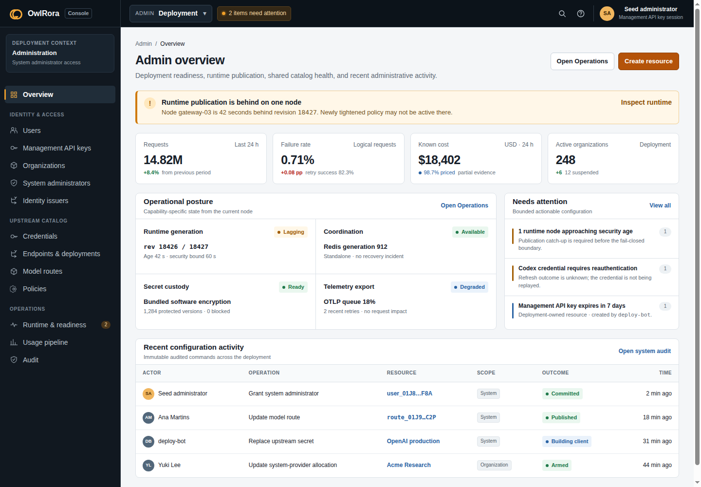
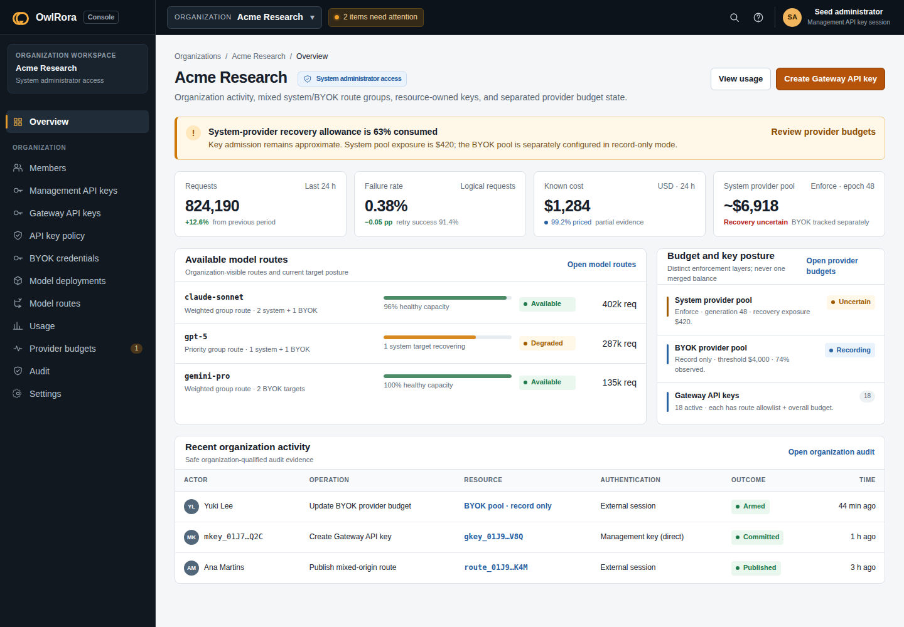

# Console visual direction

## 1. Design intent

OwlRora Console is an operations and administration product, not an AI chat surface. It should feel calm, precise, dense, and trustworthy under sustained daily use.

The visual model combines:

- GitLab-like context separation and navigation density;
- a dark, stable context sidebar against a light working canvas;
- restrained warm amber as the OwlRora brand/action accent;
- neutral system typography and compact data presentation;
- explicit operational states that never rely on color alone.

The console MUST NOT use neon AI gradients, glowing cards, glassmorphism, oversized marketing heroes, decorative prompt boxes, or low-density dashboard chrome. Visual novelty must not compete with authority, tenant context, warnings, or configuration state.

## 2. Reference mockups

The committed mockup is illustrative rather than a generated production asset:

- [`mockups/console-overview.html`](mockups/console-overview.html) — interactive Admin and organization overview reference;
- [`mockups/admin-overview.png`](mockups/admin-overview.png) — desktop Admin context capture;
- [`mockups/organization-overview.png`](mockups/organization-overview.png) — desktop organization context capture;
- [`mockups/console-layout.mmd`](mockups/console-layout.mmd) — editable structural wireframe source.

Normative information architecture, authorization, states, and workflows remain in specifications 01 and 02. The mockup demonstrates hierarchy, density, and tone; it does not freeze exact copy, metrics, or component implementation.

### 2.1 Admin overview reference

### 2.2 Organization overview reference

## 3. Visual foundations

### 3.1 Color roles

Reference tokens:

| Role | Reference | Use |
| --- | --- | --- |
| sidebar canvas | `#111820` | persistent context navigation |
| sidebar elevated | `#18232E` | selected navigation and context switcher |
| page canvas | `#F4F6F8` | application background |
| surface | `#FFFFFF` | cards, tables, editors, dialogs |
| primary text | `#17202A` | headings and primary values |
| secondary text | `#5D6975` | descriptions and metadata |
| subtle text | `#66727E` | smallest labels on white surfaces; never lighter for content text |
| border | `#DCE2E8` | component and table separation |
| amber accent | `#B45309` | primary actions, selected detail, brand mark |
| amber hover | `#8A3D05` | hover/pressed primary action |
| amber soft | `#FFF4DF` | attention state and selected context tint |
| success | `#207A4B` | healthy/applied status with text/icon |
| warning | `#A15C00` | degraded/recovery state with text/icon |
| danger | `#B42318` | failed/disabled/destructive state with text/icon |
| information | `#2962A3` | neutral operational information |
| focus on light | `#1D4ED8` | two-pixel keyboard focus ring on light surfaces |
| focus on dark | `#FBBF24` | two-pixel keyboard focus ring on top bar/sidebar |

Amber is not a general status color. Health and lifecycle use their semantic role colors plus icon/text. Large areas remain neutral so warnings retain salience. White text on amber uses `#B45309` or darker; the lighter brand amber is reserved for non-text decoration so primary controls and subtle labels meet WCAG 2.2 AA.

### 3.2 Typography

Use a native/system sans-serif stack for UI and a native monospace stack for IDs, revisions, model keys, prefixes, durations, and numerical evidence.

Reference scale:

| Token | Size / line height | Use |
| --- | --- | --- |
| page title | `24 / 32` | one H1 per page |
| section title | `16 / 24` | card/table groups |
| body | `14 / 20` | standard controls and text |
| compact | `12 / 18` | metadata, table labels, status text |
| metric | `24 / 28` | primary overview values |

Font weight creates hierarchy before size. Avoid all-uppercase section headings except tiny non-content labels.

### 3.3 Spacing and shape

Use a four-pixel base grid. Common gaps are 8, 12, 16, 24, and 32 pixels. Dense list rows target 40–44 pixels; ordinary controls target at least 36 pixels on desktop and 44 pixels on touch layouts.

Surfaces use a restrained 6–8 pixel radius, one-pixel borders, and little or no shadow. Floating menus and dialogs may use a bounded shadow. Pills are reserved for status, scope, and compact metadata; ordinary buttons and tabs are not pills.

## 4. Application shell

### 4.1 Desktop

The reference desktop shell has:

- a 56-pixel dark top bar spanning the viewport;
- a 240–256-pixel dark context sidebar below it;
- a flexible light content canvas;
- 24–32 pixels of main-content inset;
- no narrow marketing-style max width on overview and table pages.

The top bar carries only global concerns: product identity, current context switcher, bounded warnings, documentation, and actor/session origin. The sidebar carries only the current context's navigation. Breadcrumb, title, description, and primary page action begin the content area.

A persistent context label distinguishes `Admin`, membership-based organization access, and `System administrator access`. Cross-organization administration never looks identical to ordinary membership access.

### 4.2 Responsive shell

At widths below roughly 960 pixels, the sidebar becomes a drawer and overview grids reduce columns. Below roughly 640 pixels:

- page title/actions stack;
- metric cards become one or two columns;
- data tables become labeled row cards or horizontally scrollable regions;
- warnings retain full consequence text;
- context, actor, and authentication origin remain reachable without hover.

Responsive changes may reduce density but MUST NOT hide tenant context, lifecycle state, budget uncertainty, secret warnings, or ETag conflict information.

## 5. Core component language

### 5.1 Context switcher

The switcher shows context kind and safe display label on separate visual levels. Admin, Personal, and Organization choices are grouped. A system administrator opening an organization without membership sees an explicit `System access` marker before navigation and in the resulting workspace header.

### 5.2 Navigation

Navigation groups use compact labels, consistent icons, and one selected row with a subtle amber edge or marker. Selection is not expressed only by a background color. Counts appear only for actionable bounded states, such as unresolved readiness warnings; navigation is not a metrics dashboard.

Management API keys and Gateway API keys always use their complete names and remain distinct deployment/organization resources:

- deployment Management API keys appear in Admin Identity & access;
- organization Management API keys appear in that organization workspace;
- Gateway API keys appear in an organization workspace and are labeled `LLM requests` where clarification helps;
- no API key appears as a personal user-owned credential.

### 5.3 Status indicators

A status indicator combines:

- a small semantic icon or dot;
- one exact state word;
- optional concise consequence text.

Examples include `Current`, `Degraded`, `Recovery uncertain`, `Source ready`, `Client not loaded`, and `Disabled`. Avoid vague labels such as `Okay`, `Problem`, or one collapsed `Healthy` state for composite systems.

### 5.4 Metric cards

Overview metrics answer a bounded operational question and include period/unit plus comparison or completeness state. They do not imply exact financial balance. Cost cards distinguish known/partial/unknown. Budget cards identify approximate policy and recovery uncertainty.

Cards should not all compete equally: one compact metric row is followed by richer operational evidence and tables.

### 5.5 Tables and lists

Tables use sticky headers where useful, subtle row separators, right-aligned numerical values, monospace identifiers, and a dedicated status column. Row actions sit at the end and never depend on hover alone. Filters and time ranges sit above the table rather than inside each column header.

### 5.6 Alerts

Alerts lead with affected capability and consequence, not dependency internals. A warning might say `Runtime publication is 42 s behind; newly disabled credentials may not be enforced on this node` and link to Operations. Alerts never dump provider, SQL, Redis, or custody errors.

### 5.7 Forms and destructive actions

Forms group fields by domain meaning rather than one card per field. Write-only secret fields have persistent explanatory text. The primary action appears once per editor. Destructive and authority-changing controls use explicit labels and a confirmation that names actor, target, current state, resulting state, and consequence.

### 5.8 One-time secret reveal

A one-time Management-key or Gateway-key result is visually isolated from ordinary success state. It includes credential class, deployment/organization resource scope, scopes/capability profile, expiry, safe creator attribution, copy/download controls, and a clear `Will not be shown again` statement. It never labels a local user as key owner. Management and gateway key prefixes are visible enough to prevent copying the wrong credential into an LLM or management client.

## 6. Overview composition

### 6.1 Admin overview

Order the page by operational decision value:

1. breadcrumb, deployment title, readiness, and primary action;
2. capability-impact warnings;
3. bounded request/failure/cost/budget summaries;
4. runtime publication, Redis coordination, secret custody, and telemetry evidence;
5. security/configuration items requiring attention;
6. recent audited configuration activity.

Identity, catalog, and operations summaries link to dedicated pages instead of turning the overview into an unbounded control center.

### 6.2 Organization overview

The organization overview reuses the shell but changes content and navigation completely:

1. organization identity, actor access reason, and lifecycle;
2. separate Gateway-key overall, system-provider, and BYOK budget warnings plus key-rate warnings;
3. requests, failure, retry, known cost, and token summaries;
4. available routes and target availability;
5. recent safe organization activity.

It does not show global Redis topology, custody providers, all users, or cross-tenant catalog management.

## 7. Motion and feedback

Motion is functional and short: 120–180 ms for drawers, menus, tab indicators, and disclosure. Avoid ambient animation. Streaming metrics do not constantly count unless the user selected a live view. Loading uses stable skeleton geometry; a spinner does not replace page context.

Commands show request progress, then exact committed/pending-publication state. A browser never presents optimistic success before the authoritative response. `412` transitions to the conflict workflow rather than a generic toast.

## 8. Accessibility

- Text and controls meet WCAG 2.2 AA contrast at minimum.
- Keyboard focus uses a persistent two-pixel or stronger indicator with at least 3:1 contrast against the adjacent surface: `#1D4ED8` on light surfaces and `#FBBF24` on dark surfaces are the reference tokens. Hover/background changes alone are insufficient, and components MUST NOT remove the default outline without supplying this equivalent.
- Skip links and semantic landmarks cover top bar, navigation, and main content.
- Icon-only controls have accessible names and tooltips.
- Charts expose equivalent tabular summaries.
- Status is never conveyed only by hue, position, or animation.
- Dense tables preserve a logical screen-reader order and meaningful headers.
- Reduced-motion preference disables nonessential transitions.

## 9. Implementation boundary

Production components live in `apps/web` and use shared design tokens rather than copying mockup CSS. The mockup has no runtime API, authorization, or routing role and MUST NOT be embedded as production assets.

Visual tokens may evolve without changing domain behavior. A visual change may not erase the distinctions between Admin/organization/personal context, system/membership access, management/gateway keys, key overall vs system-provider vs BYOK budgets, enforce vs record-only mode, exact lifecycle states, budget uncertainty, or one-time secret semantics.
